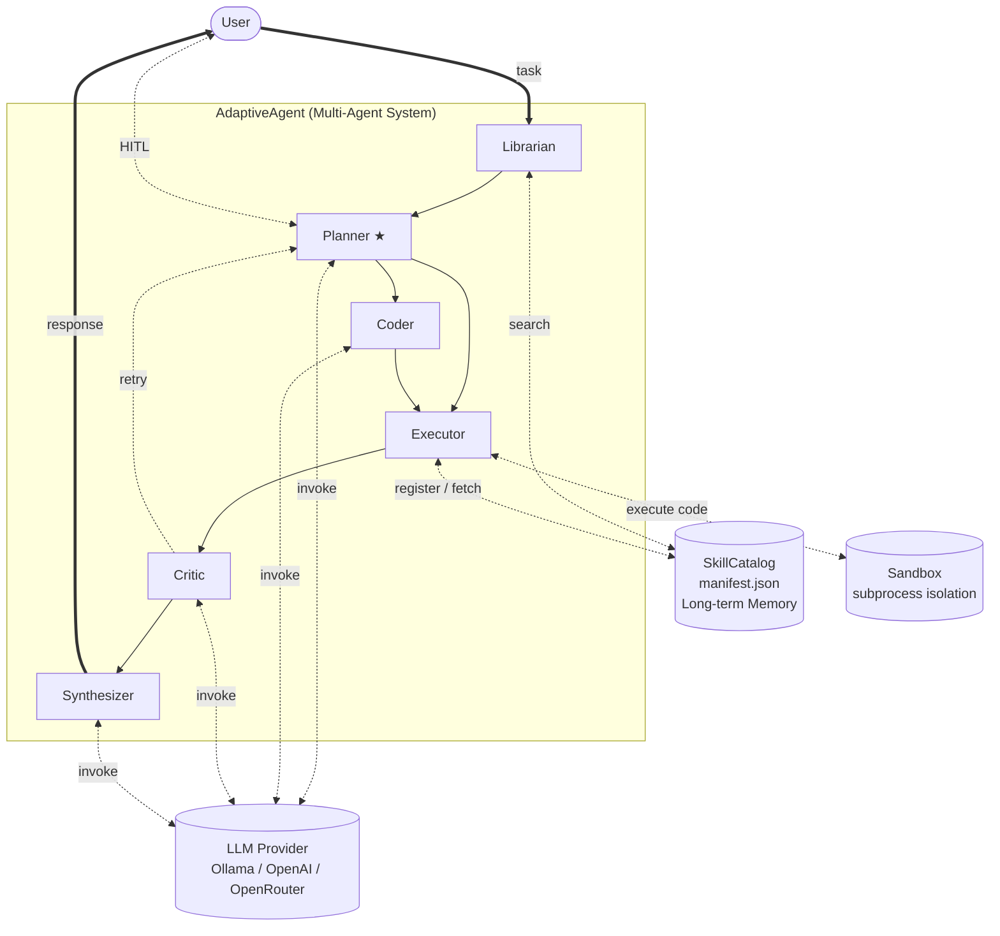

# AdaptiveAgent

    **작성자**: eunji.kim
    **프로젝트**: AdaptiveAgent — 자연어 기반 동적 툴 생성·실행 멀티 에이전트 시스템


---

## 목차

- [AdaptiveAgent](#adaptiveagent)
  - [목차](#목차)
  - [1. 프로젝트 개요](#1-프로젝트-개요)
  - [2. 시스템 아키텍처](#2-시스템-아키텍처)
    - [2-1. 시스템 아키텍처](#2-1-시스템-아키텍처)
    - [2-2. 에이전트 역할](#2-2-에이전트-역할)
    - [2-3. 빌트인 툴](#2-3-빌트인-툴)
    - [2-4. 프롬프트 설계](#2-4-프롬프트-설계)
  - [3. 설계 결정 사항](#3-설계-결정-사항)
    - [3-1. 상태 기계 기반 실행 흐름](#3-1-상태-기계-기반-실행-흐름)
    - [3-2. 역할 분리 아키텍처 — 자기 평가 편향 방지](#3-2-역할-분리-아키텍처--자기-평가-편향-방지)
    - [3-3. 프롬프트 외부화 및 파일 기반 관리](#3-3-프롬프트-외부화-및-파일-기반-관리)
    - [3-4. subprocess 기반 샌드박스](#3-4-subprocess-기반-샌드박스)
    - [3-5. SkillCatalog — 장기 스킬 메모리](#3-5-skillcatalog--장기-스킬-메모리)
  - [4. 한계 및 개선 가능 방향](#4-한계-및-개선-가능-방향)
    - [4-1. 세션 장기화에 따른 컨텍스트 증가](#4-1-세션-장기화에-따른-컨텍스트-증가)
    - [4-2. 스킬 자가 진화 (Self-Evolve) 미구현](#4-2-스킬-자가-진화-self-evolve-미구현)
    - [4-3. 샌드박스 격리 강도 한계](#4-3-샌드박스-격리-강도-한계)
    - [4-4. 사용자 구분 — workspace 기반으로 해결](#4-4-사용자-구분--workspace-기반으로-해결)
    - [4-6. Critic의 정답 검증 한계](#4-6-critic의-정답-검증-한계)
    - [4-7. PlanAgent 오케스트레이터 의존도 — 단일 실패 지점](#4-7-planagent-오케스트레이터-의존도--단일-실패-지점)
  - [5. 환경 설정 및 실행 방법](#5-환경-설정-및-실행-방법)
    - [5-1. 환경 요구사항 및 설치](#5-1-환경-요구사항-및-설치)
    - [5-2. .env 설정 (LLM provider 선택)](#5-2-env-설정-llm-provider-선택)
    - [5-3. Ollama 서버 실행 (로컬 LLM)](#5-3-ollama-서버-실행-로컬-llm)
    - [5-4. 실행](#5-4-실행)
  - [참고 문헌](#참고-문헌)
  - [부록 C. 권장 모델 등급 — 코드 생성 임계점](#부록-c-권장-모델-등급--코드-생성-임계점)
    - [모델 선택 가이드라인](#모델-선택-가이드라인)
    - [외부 벤치마크 근거](#외부-벤치마크-근거)
    - [권장 최소 모델 등급](#권장-최소-모델-등급)
    - [모델 학습 방식의 영향](#모델-학습-방식의-영향)

---

## 1. 프로젝트 개요

AdaptiveAgent는 사용자의 자연어 태스크를 입력받아 Python 툴을 동적으로 생성·실행·검증하고, 승인된 툴을 스킬 라이브러리에 저장해 이후 세션에서 재사용하는 CLI 기반 멀티 에이전트 시스템이다.

시스템은 아래 원칙 하에 설계됐다.

**원칙 1 — 역할 분리 (Separation of Concerns)**: 계획(Plan)·구현(Code)·실행(Execute)·평가(Critique)를 독립 에이전트로 분리한다. 동일한 LLM이 코드를 생성하고 스스로 평가하면 자기 평가 편향(Self-Evaluation Bias)으로 오류 검출률이 낮아진다. 역할 분리는 이 구조적 한계를 해소하고, 에이전트가 자신의 출력을 비판적으로 검토하는 구조를 만든다.

**원칙 2 — 인간 개입 설계 (Human-in-the-Loop)**: 에이전트는 자율적으로 실행하되, 위험 작업·정보 부족의 두 지점에서 반드시 멈추고 사용자 확인을 기다린다. 에이전트의 장기 메모리(SkillCatalog)는 사용자가 승인한 것만 포함한다.

---

## 2. 시스템 아키텍처

### 2-1. 시스템 아키텍처

AdaptiveAgent는 6개의 내부 에이전트로 구성된 멀티 에이전트 시스템이다. 시스템은 외부 인프라(사용자, LLM Provider, 장기 메모리, 샌드박스)와 명확한 경계를 가지고 상호작용한다.



**구성 요소**

*외부 인프라 (System Boundary 외부)*
- **사용자** — 자연어 태스크 입력, HITL 응답, 최종 답변 수신
- **LLM Provider** — Ollama·OpenAI·OpenRouter 중 하나. 4개 에이전트(Planner/Coder/Critic/Synthesizer)가 공유 호출
- **SkillCatalog** — `manifest.json` 기반 장기 메모리. 세션 간 영속
- **Sandbox** — `LocalSandboxBackend`. subprocess 수준 격리

*내부 에이전트 (실행 순서)*

| 순서 | 에이전트 | 역할 | LLM |
|:---:|:---|:---|:---:|
| 1 | **Librarian** | SkillCatalog에서 관련 스킬 검색 | ✗ |
| 2 | **Planner ★** | 다음 실행 노드 결정 (오케스트레이터) | ✓ |
| 3 | **Coder** | Python 코드 생성 (필요 시) | ✓ |
| 4 | **Executor** | 툴 또는 생성 코드 실행 | ✗ |
| 5 | **Critic** | 결과 평가 → 재시도/성공 판정 | ✓ |
| 6 | **Synthesizer** | 결과를 자연어로 요약 | ✓ |

**Planner(오케스트레이터)★ **: Planner는 단순 계획 생성기가 아니라, LLM 출력에서 action을 해석해 **다음에 실행할 노드를 직접 결정하는 오케스트레이터**다.

| Planner 결정 | 다음 노드 |
|:---|:---|
| `code_execute` / `tool_create` | Coder |
| `tool` / `parallel` | Executor |
| `needs_user_input` / `approve` | HITL (사용자) |
| `respond` | 종료 (대화형 응답) |


---

### 2-2. 에이전트 역할

| 에이전트 | 노드 | LLM | 책임 |
|:---------|:----:|:---:|:-----|
| **LibrarianAgent** | `retrieve` | ✗ | SkillCatalog 검색, stale 항목 감지 |
| **PlanAgent** | `plan` | ✓ | action 결정 + **다음 노드 routing** (오케스트레이터) |
| **CoderAgent** | `code` | ✓ | Mode A: 인라인 스크립트 / Mode B: `def run()` 함수 생성 |
| **ExecutorAgent** | `execute` | ✗ | 빌트인·생성 툴 실행, 병렬 실행, 자가 수정 루프 |
| **CriticAgent** | `critique` | ✓ | 성공/재시도/에스컬레이션 판정, reflections 누적 |
| **SynthesizerAgent** | `synthesize` | ✓ | 실행 결과 자연어 요약, code_save 플래그 |

> CoderAgent는 `ADAPTIVE_AGENT_CODER_LLM` / `ADAPTIVE_AGENT_CODER_MODEL`로 전용 모델 분리 가능.

---

### 2-3. 빌트인 툴

ExecutorAgent가 실행할 수 있는 툴은 두 종류다: **빌트인 툴**(코드에 내장)과 **생성 툴**(사용자 승인 후 SkillCatalog에 등록).

**빌트인 툴 목록**

| 카테고리 | 툴 | 설명 |
|:---------|:---|:-----|
| **실행** | `code_execute` | Python 인라인 스크립트를 샌드박스에서 실행 |
| | `shell_run` | 쉘 명령어 실행 (위험 패턴 필터링) |
| **파일** | `file_read` | workspace 내 파일 읽기 |
| | `file_write` | workspace 내 파일 쓰기 |
| | `file_list` | 디렉터리 목록 조회 |
| | `file_patch` | 파일 부분 수정 (unified diff) |
| **툴 생명주기** | `tool_create` | 생성 툴 파일 생성 + AST 검사 |
| | `tool_validate` | 샘플 인자로 생성 툴 실행 검증 |
| | `tool_approve` | 사용자 승인 후 manifest 등록 |
| | `tool_search` | SkillCatalog 키워드/임베딩 검색 |
| | `generated_tool_execute` | 등록된 생성 툴 동적 실행 |
| **HITL** | `ask_human` | 사용자에게 추가 정보 요청 |
| | `propose_actions` | 사용자에게 선택지 제시 |
| **스킬 관리** | `skill_list` | 등록된 스킬 목록 조회 |
| | `skill_delete` | 스킬 삭제 |
| **저장** | `memory_read` / `memory_write` | 키-값 세션 메모리 읽기·쓰기 |
| | `artifact_store` | 실행 아티팩트 파일 저장 |

---

### 2-4. 프롬프트 설계

역할별 프롬프트를 `adaptive_agent/prompts/default/*.txt`에 코드와 분리해 관리한다.

| 프롬프트 | 주요 입력 | 출력 형식 |
|:---------|:---------|:---------|
| `plan.txt` | `{task}`, `{retrieved_skills}`, `{conversation_history}`, `{last_tool_result}`, `{reflections}`, `{available_tools}` | `{"action":..., "reasoning":...}` |
| `coder.txt` | `{plan}`, `{task}`, `{observations}` | `{"code":...}` |
| `critic.txt` | `{task}`, `{current_plan}`, `{last_tool_result}`, `{reflections}`, `{error_log}` | `{"verdict":..., "reflection":..., "next_node":...}` |
| `correction.txt` | `{task}`, `{failed_plan}`, `{error}`, `{output}` | `{"action":..., "tool_name":...}` |
| `synthesize.txt` | `{task}`, `{tool_name}`, `{stdout}`, `{generated_code}`, `{language}` | 자연어 문장 |

**설계 원칙**

1. **reasoning 필수 (Chain-of-Thought)**: `plan.txt`는 모든 응답에 `"reasoning"` 필드를 필수 요구. 행동 선택 전 이유를 서술하면 routing 품질이 향상되고, 터미널 `💭` 라인으로 노드의 판단 근거가 실시간 노출된다.
2. **대조 예시 (Contrastive Prompting)**: WRONG/RIGHT 형식으로 소형 모델의 이중 인코딩·markdown fence 삽입 같은 반복적 포맷 오류를 프롬프트 수준에서 선제 차단한다. OpenAI Codex 가이드, SWE-agent(Princeton NLP, 2024) 동일 패턴.

---

## 3. 설계 결정 사항

### 3-1. 상태 기계 기반 실행 흐름

**결정**: 노드의 실행 흐름을 `StateMachineRouter`와 `AgentState`의 조합으로 구현한다.

`AgentState`의 핵심 설계 원칙: **각 필드는 정확히 하나의 노드가 쓰고(write), 이후 노드들이 읽는(read) 단방향 계약**이다. 유일한 예외는 `reflections`로, Critic이 쓰고 Planner가 읽는 피드백 루프를 형성한다.

```
Librarian  →  retrieved_skills  →  Planner
Planner    →  current_plan      →  Coder, Executor
Coder      →  generated_code    →  Executor, Critic, Synthesizer
Executor   →  last_tool_result  →  Critic, Synthesizer
Critic     →  reflections       →  Planner (피드백), next_node → Router
```

`StateMachineRouter`는 `next_node`만 보고 다음 노드를 호출한다. 노드들은 서로를 직접 호출하지 않는다. 이 **직접 결합(direct coupling) 없는 설계**가 각 노드를 독립적으로 테스트·교체 가능하게 만든다.

**이유**

단방향 데이터 흐름이 실패 귀인(failure attribution)을 자동으로 가능하게 한다. 어떤 노드가 실패했는지는 `events` 타임라인에서 즉시 확인된다. AAVS 검증에서 `plan_validation_failed`, `execution_critiqued`, `failure_classified` 이벤트 순서만 보고 어느 노드(Planner / Coder / Critic)에서 실패했는지를 구분할 수 있다.

---

### 3-2. 역할 분리 아키텍처 — 자기 평가 편향 방지

**결정**: Plan(무엇을 할지) / Coder(어떻게 구현할지) / Critic(결과가 좋은지) 세 역할을 독립적인 에이전트로 분리한다.

**이유**

계획 수립과 코드 구현은 LLM에게 요구하는 역량이 다르다. 하나의 LLM 호출로 "계획을 JSON으로 내고 동시에 Python 코드를 작성하라"고 요구하면 두 가지 문제가 발생한다.

첫째, **소형 모델에서 포맷 불안정성**이 심화된다. 소형 모델은 plan과 code를 동시에 요구할 때 JSON이 잘리거나 이중 인코딩되는 현상이 자주 발생한다. 역할을 분리하면 각 LLM 호출이 단순해지고 포맷 안정성이 높아진다.

둘째, **역할별로 다른 모델을 사용하는 구조가 불가능**해진다. 플래너는 빠른 소형 모델로, 코더는 코딩 특화 모델로 교체하는 최적화가 역할 분리 없이는 어렵다.

**역할별 부담 차이**

각 역할이 LLM에게 요구하는 출력 복잡도가 다르다.

| 역할 | 출력 형식 | 복잡도 |
|:-----|:---------|:------|
| Planner (tool 선택) | 단순 JSON (`action`, `reasoning`) | 낮음 |
| Coder (Python 생성) | 멀티라인 코드 + JSON 래핑 | 높음 |
| Critic (결과 평가) | 이진 판정 + 짧은 reflection | 낮음 |

이 구조에서 Coder 단계가 전체 파이프라인의 가장 큰 변동성 원인이 되며, 역할 분리는 이 변동성을 다른 단계로 전파시키지 않기 위한 격리 장치다.

---

### 3-3. 프롬프트 외부화 및 파일 기반 관리

**결정**: 역할별 시스템 프롬프트를 코드와 분리하여 `adaptive_agent/prompts/default/*.txt`에 관리한다.

**이유**

프롬프트는 LLM 동작을 결정하는 핵심 요소인데, 동시에 가장 자주 수정되는 부분이다. 코드에 하드코딩하면 프롬프트를 고칠 때마다 코드 배포가 필요하고, 변경 이력도 코드 diff에 묻힌다.

파일로 분리하면:
- 코드 배포 없이 프롬프트 실험 가능
- A/B 테스트 시 버전 비교가 명확
- `prompts/openai/`, `prompts/ollama-general/` 같은 provider별 분기를 `PromptLoader`의 fallback 체인으로 지원 가능 (현재는 model별 fallback 체인을 사용하고 있지 않음)

---

### 3-4. subprocess 기반 샌드박스

**결정**: 코드 실행 환경으로 `LocalSandboxBackend`(subprocess)만 구현한다. Docker 컨테이너 격리는 현재 설계에서 의도적으로 제외한다.

**구조**

```
ExecutorAgent
  └── LocalSandboxBackend
        ├── subprocess.run(["python", script_path], ...)
        ├── timeout    : config.sandbox_timeout_seconds (기본 30s)
        ├── cwd        : <workspace>/sandbox/
        ├── env filter : 화이트리스트 환경 변수만 전달
        └── 위험 패턴 필터: shell_run에 대해 정규식 기반 사전 차단
```

`SandboxBackend`는 **추상 인터페이스**로 정의되어 있다. `LocalSandboxBackend`는 그 첫 구현체이며, 향후 Docker·gVisor·Firecracker 백엔드를 동일 인터페이스로 추가할 수 있다.

**이유**

배포 환경에 따라 적절한 격리 강도가 다르기 때문이다. 현 단계에서는 코어 기능(에이전트 흐름, 툴 생성·검증, 스킬 카탈로그)을 먼저 안정화하고, 격리 백엔드는 운영 타깃이 정해진 시점에 인터페이스 교체로 대응하는 것이 합리적이다.

- **로컬 개발**: subprocess만으로 충분. 사용자 본인의 코드 실행과 동등한 권한이면 된다.
- **팀 공유 서버**: Docker + 네트워크 비활성화가 일반적인 균형점.
- **클라우드 멀티테넌트**: gVisor·Firecracker 같은 강한 격리가 필요. 그러나 이 단계에서는 인증·과금·리소스 쿼터 등 다른 인프라 의존성이 더 크다.

격리 백엔드를 처음부터 Docker로 강제하면 로컬 개발 진입 장벽이 올라간다 (Docker Desktop 설치, 이미지 빌드, 볼륨 마운트, 네트워크 설정). 현 단계의 사용자 시나리오 — 단일 사용자가 자신의 머신에서 자신의 LLM과 작업 — 에서는 비용 대비 효익이 낮다.

**현재 방어 수준**

`LocalSandboxBackend`는 OS 수준 격리를 제공하지 않는다. 다음 두 가지로 실용적 안전성을 확보한다:

1. **사전 패턴 필터**: `shell_run` 입력에 대해 정규식 기반으로 명백한 위험 명령(`rm -rf /`, `:(){:|:&};:`, 외부 네트워크 다운로드 등)을 차단.
2. **AST 검사**: `tool_create`로 생성되는 코드는 AST 파싱 후 import 화이트리스트 외 모듈, `eval`/`exec` 사용, 파일 시스템 직접 조작 등을 검출.
3. **HITL 승인**: `tool_approve`는 항상 사용자 확인을 거친다. 신규 코드가 자동으로 영속 스킬이 되지 않는다.

---

### 3-5. SkillCatalog — 장기 스킬 메모리

**결정**: 승인된 생성 툴을 `manifest.json`에 저장하고, Top-K 검색으로 세션 간 재사용한다.

**구조**

```
manifest.json (SkillCatalog)
  └── {tool_name}
       ├── description, parameters, returns
       ├── file_hash           ← 파일 위변조 감지
       ├── validated, approved ← 상태 추적
       ├── embedding           ← 코사인 유사도 검색용
       ├── usage_count         ← 사용 통계
       └── failure_count       ← 품질 모니터링
```

**이유**

에이전트가 매번 새로 툴을 생성하는 것은 비효율적이고 일관성이 없다. SkillX(2026) 연구가 제시하는 "플러그 앤 플레이 스킬 지식 기반" 개념처럼, 한 번 검증된 툴이 이후 세션에서 검색·재사용되어야 에이전트의 장기적 학습이 가능하다.

검색은 키워드 + 태그 기반 Top-K와 OpenAI embedding 코사인 유사도를 병행한다. OpenAI API key가 없으면 키워드 검색으로 폴백한다.

`usage_count`와 `failure_count`를 기록하는 것은 향후 스킬 품질 모니터링과 자가 진화의 기반 데이터다.

---

## 4. 한계 및 개선 가능 방향

### 4-1. 세션 장기화에 따른 컨텍스트 증가

**현재 상태**

`AgentState.reflections`, 이벤트 로그, `last_tool_result`는 세션이 길어질수록 누적된다. 이것이 각 LLM 호출의 컨텍스트에 포함되기 때문에, 세션이 길어질수록 호출 비용과 응답 지연이 증가하고 소형 모델에서는 포맷 안정성이 저하된다.

correction 맥락이 길어질 때 `plan_not_object` 오류가 증가하는 현상이 관찰된다.

**개선 방향**

**Memory Compact**: 일정 threshold를 넘으면 오래된 reflection과 이벤트를 요약·압축한다. 예를 들어 마지막 3개 reflection은 그대로 유지하고, 이전 것들은 "요약: [핵심 교훈]" 형태로 압축한다.

**Context Budget 관리**: 모델별 최대 컨텍스트 토큰 수를 `config.py`에 정의하고, 프롬프트 렌더링 시 우선순위가 낮은 정보(오래된 이벤트, 사용된 reflection)를 제외한다. `PromptLoader.render()`에 budget 파라미터를 추가하는 방식으로 구현 가능하다.

---

### 4-2. 스킬 자가 진화 (Self-Evolve) 미구현

**현재 상태**

툴이 한 번 `tool_approve`로 등록되면 이후 변경이 없다. 특정 입력에서 실패하거나 더 나은 구현이 가능한 경우에도 자동 갱신 메커니즘이 없다.

`failure_count`를 이미 기록하고 있지만, 이를 활용하는 트리거 로직이 구현되지 않았다.

**개선 방향**

AgentEvolver(2025)가 제시하는 상향식 스킬 진화 방향을 점진적으로 도입할 수 있다.

단기: `failure_count >= N`이거나 오래된 스킬(`last_used`가 임계값 초과)에 대해 Librarian이 "재작성 제안" 이벤트를 발행하고, 사용자 확인 후 새 버전을 생성·재검증하는 흐름.

중기: 기능이 겹치는 스킬을 자동 감지(`embedding` 유사도 기반)해 병합 또는 제거를 제안한다. EvolveTool-Bench가 지적한 "라이브러리 오염" 문제를 선제적으로 방지한다.

---

### 4-3. 샌드박스 격리 강도 한계

**현재 상태**

`LocalSandboxBackend`는 subprocess 수준의 격리만 제공한다. 생성 코드가 네트워크를 사용하거나 허용된 경로 밖의 파일에 접근하는 것을 완전히 차단하지 못한다. 현재 구현은 정책 기반 패턴 매칭으로 위험 패턴을 감지하는 방어 수준이다.

**개선 방향**

`SandboxBackend` 인터페이스가 이미 추상화되어 있어, 배포 환경이 확정되면 강도 높은 격리를 끼워 넣는 것이 구조적으로 가능하다.

| 환경 | 권장 샌드박스 |
|:-----|:------------|
| 로컬 개발 | LocalSandboxBackend (현재) |
| 팀 공유 서버 | Docker + 네트워크 비활성화 |
| 클라우드 서비스 | gVisor, Firecracker, Kata Containers |
| CI/CD | 전용 컨테이너 이미지 |

중요한 것은 어떤 환경에서 운영할지에 따라 격리 수준이 달라지므로, 이를 설계 단계에서 고정하지 않고 인터페이스 교체로 대응하는 현재 방향이 맞다.

---

### 4-4. 사용자 구분 — workspace 기반으로 해결

**현재 상태 (해결됨)**

`--workspace PATH` 옵션으로 사용자별 독립된 작업 공간을 지정한다. workspace가 사용자 식별자 역할을 한다.

```
~/team/alice/skills/manifest.json  ← alice의 스킬 라이브러리
~/team/bob/skills/manifest.json    ← bob의 스킬 라이브러리 (완전 격리)
```

각 workspace는 `skills/`, `sessions/`, `logs/`, `artifacts/` 하위 구조를 자동 생성하므로 별도 초기화 절차 없이 사용 가능하다.

**서비스 형태 전환 시 추가 고려 사항**

- **스킬 격리 계층**: 개인 manifest + 공유(org) manifest 구조
- **권한 관리**: 위험 툴 실행 권한, 파일시스템 접근 제한
- **다중 세션**: `session_id`는 UUID 기반이므로 SessionStore 수준에서 확장 가능

—

### 4-6. Critic의 정답 검증 한계

**현재 상태**

Critic의 판정 기준: "실행이 성공(exit_code=0)하고 JSON 출력이 있으면 success"

이것이 현재 Critic의 근본적 한계다. 코드가 실행은 됐지만 결과가 태스크 요구사항과 다른 경우를 잡지 못한다.

**개선 방향**

완전한 자동 검증은 불가능하다. 그러나 다음 두 가지 수준의 개선은 현실적이다.

**수준 1 — Critic 프롬프트 강화**: task 원문과 실행 결과를 같이 주고 "입력 데이터와 출력이 의미적으로 일치하는지" 확인하도록 critic.txt를 개선한다. 숫자 범위 이탈, 빈 결과, 요청된 필드 누락 같은 명백한 오류는 프롬프트 수준에서 잡을 수 있다.

**수준 2 — 검증 가능한 태스크에 한해 자동 검증 추가**: 특정 시나리오처럼 기대 출력이 정의 가능한 경우, Executor가 실행 후 기대값과 대조하는 `assertion_check` 단계를 선택적으로 추가한다.

플래너 수준에서도 보완: 파라미터 변경 요청(예: "기본값 0.05로 써줘")을 `respond`로만 처리하던 동작을 `code_execute` 재실행으로 강제해 계산 결과 없는 응답(할루시네이션)을 줄인다.

---

### 4-7. PlanAgent 오케스트레이터 의존도 — 단일 실패 지점

**현재 상태**

PlanAgent는 단순한 계획 생성기가 아니라, **다음 실행 노드를 직접 결정하는 오케스트레이터**다. Planner의 LLM 출력 품질이 전체 파이프라인의 성패를 좌우한다.

```
Planner 결정 → code  : Coder가 코드 생성
Planner 결정 → execute : Executor가 직접 실행
Planner 결정 → approve : 사용자 확인 요청
Planner 결정 → done  : 대화형 응답으로 종료
```

Planner가 잘못된 action을 선택하면 — 예를 들어 코드 실행이 필요한 태스크에 `respond`를 선택하거나, 직접 실행 가능한 스킬에 `tool_create`를 선택하면 — 이후 Coder·Executor·Critic 단계가 전부 무의미해진다.

**모델 크기와 Planner 정확도**

소형 모델일수록 다음 문제가 발생한다:

- **포맷 불안정**: `reasoning` 필드 누락, JSON 이중 인코딩, 필수 필드 누락
- **tool 선택 오류**: `code_execute`와 `tool_create`를 혼동, `respond`로 태스크 회피
- **컨텍스트 과부하**: 세션이 길어져 `reflections`와 `conversation_history`가 누적되면 소형 모델은 포맷 준수율이 급격히 떨어짐

Qwen3 Tech Report(arXiv:2505.09388) 기준 EvalPlus:
- 4B: 63.53 / 8B: 67.65 — 8B 이하에서 복합 태스크 불안정

**한계**

Planner 출력이 올바른지 검증하는 독립적인 노드가 없다. 현재는 `_normalize_plan()` 함수가 포맷 오류를 복구하지만, 의미적으로 잘못된 action 선택(예: 계산 태스크에 `respond` 반환)은 감지하지 못한다.

**개선 방향**

- **Planner 전용 모델 분리**: `ADAPTIVE_AGENT_CODER_LLM`처럼 Planner에도 별도 경량 모델을 지정해 비용 절감
- **Plan 검증 레이어**: Planner 출력의 의미적 타당성을 규칙 기반으로 사전 검사
- **Context Budget**: `reflections`와 `conversation_history`에 최대 토큰 예산을 적용해 소형 모델 포맷 안정성 유지

---

## 5. 환경 설정 및 실행 방법

### 5-1. 환경 요구사항 및 설치

| 항목 | 최소 요구 |
|:-----|:---------|
| Python | 3.10 이상 (권장: 3.12) |
| 패키지 관리 | Poetry 2.x |
| OS | macOS / Linux (Windows는 WSL2 권장) |
| LLM | Ollama(로컬) **또는** OpenAI API 키 **또는** OpenRouter API 키 |

**Poetry 설치 (최초 1회)**

```bash
curl -sSL https://install.python-poetry.org | python3 -
# 설치 후 PATH에 추가 (zsh/bash ~/.zshrc 또는 ~/.bashrc)
export PATH="$HOME/.local/bin:$PATH"
```

**프로젝트 설치**

```bash
git clone https://github.com/WOWEunji/AdaptiveAgent.git
cd AdaptiveAgent

# 의존성 설치 + 가상환경 생성 (poetry.lock 기준으로 버전 고정)
poetry install

# 환경 설정 파일 생성
cp .env.example .env
# → .env 열어서 API 키 입력

# 설치 확인
poetry run adaptive-agent --help
```

**가상환경 진입 (선택)**

```bash
poetry shell
# 이후 poetry run 없이 바로 사용 가능
adaptive-agent --help
```

---

### 5-2. .env 설정 (LLM provider 선택)

`.env.example`을 복사한 뒤 사용할 provider에 맞게 주석 해제 및 API 키를 입력한다.

```bash
cp .env.example .env
```

**권장 모델 등급**

| Provider | 권장 최소 | 비고 |
|:---------|:---------|:-----|
| Ollama | `qwen3.5:9b` | 9b 미만은 Coder 단계 신뢰성 저하 |
| OpenAI | `gpt-5.4-mini` | nano도 동작하나 mini 이상 권장 |
| OpenRouter | 9B 파라미터 이상 | 무료 플랜 일일 **50회 한도** 주의 |

> **⚠ OpenRouter 무료 플랜 주의**: 무료 모델은 일일 요청이 약 50회로 제한된다. 에이전트 1회 실행에 Planner·Coder·Critic 등 여러 LLM 호출이 발생하므로 실질적인 가용 태스크 수는 더 적다. 초과 시 API 오류가 발생한다.

**설정 예시**

```dotenv
# ── Ollama (로컬, 권장 최소: qwen3.5:9b) ──────────────────
ADAPTIVE_AGENT_LLM=ollama
OLLAMA_MODEL=qwen3.5:9b          # 권장 최소
# OLLAMA_MODEL=qwen3.5:2b        # 경량 테스트용 (Coder 신뢰성 낮음)
# OLLAMA_MODEL=qwen3.5:14b       # 고품질
# OLLAMA_MODEL=qwen2.5-coder:7b  # 코드 특화
OLLAMA_PORT=11434
OLLAMA_TIMEOUT_SECONDS=120

# ── OpenAI (권장 최소: gpt-5.4-mini) ──────────────────────
# ADAPTIVE_AGENT_LLM=openai
# OPENAI_API_KEY=sk-...
# OPENAI_MODEL=gpt-5.4-mini      # 권장 최소
# OPENAI_MODEL=gpt-5.4-nano      # 경량, 비용 절감
# OPENAI_MODEL=gpt-4.1-mini
# OPENAI_MODEL=gpt-4.1-nano

# ── OpenRouter (권장: 9B 이상, ⚠ 일일 50회 한도) ──────────
# ADAPTIVE_AGENT_LLM=openrouter
# OPENROUTER_API_KEY=sk-or-...
# OPENROUTER_MODEL=nvidia/nemotron-nano-9b-v2:free       # 권장 최소 (9B)
# OPENROUTER_MODEL=nvidia/nemotron-3-nano-30b-a3b:free   # 30B
# OPENROUTER_MODEL=openai/gpt-oss-120b:free              # 120B
# OPENROUTER_MODEL=nvidia/nemotron-3-super-120b-a12b:free

# ── 공통 설정 ─────────────────────────────────────────────
# 최종 답변 출력 언어 (ko | en | ja ...)
ADAPTIVE_AGENT_LANGUAGE=ko

# 코드 실패 시 자가 수정 최대 횟수 (총 실행 = 1 + N회)
ADAPTIVE_AGENT_MAX_SELF_CORRECTIONS=2  # 기본값: 최초 1회 + 수정 최대 2회

# 작업 공간 고정 (선택)
# ADAPTIVE_AGENT_WORKSPACE=/home/alice/my-workspace
```

> **보안**: `.env`는 절대 Git에 커밋하지 않는다. `.gitignore`에 포함되어 있는지 확인할 것.

---

### 5-3. Ollama 서버 실행 (로컬 LLM)

```bash
bash scripts/ollama_serve.sh --model qwen3.5:9b
```

포트·호스트 설정은 `.env`의 `OLLAMA_PORT` / `OLLAMA_HOST`를 참고한다.

---

### 5-4. 실행

```bash
# 대화형 루프
poetry run adaptive-agent --workspace ~/my-ws --llm openai interactive

# 시나리오 검증
poetry run adaptive-agent --workspace ~/my-ws --llm openai test
```

`--llm` 옵션: `openai` / `ollama` / `openrouter`

`--workspace`는 스킬 라이브러리와 로그가 저장되는 경로다. 생략하면 실행마다 임시 경로가 생성되어 스킬이 유지되지 않는다.

---

## 참고 문헌

| 논문 | 관련 설계 항목 |
|:-----|:-------------|
| SkillX (2026) | SkillCatalog 다층 스킬 구조 |
| EvolveTool-Bench (2026) | 툴 라이브러리 품질 관리, 3단계 파이프라인 |
| AgentEvolver / Bottom-Up Skill Evolution (2025) | Self-Evolve 개선 방향 |
| A Probabilistic Inference Scaling Theory for LLM Self-Correction (EMNLP 2025) | Self-Correction 임계점 설계 |
| Which Agent Causes Task Failures (2025) | 역할 분리 및 실패 귀인 구조 |
| Model Context Protocol (MCP, 2024~) | 툴 인터페이스 표준화 참고 |

## 부록 C. 권장 모델 등급 — 코드 생성 임계점

### 모델 선택 가이드라인

AdaptiveAgent는 초기에 최대한 작은 모델에서 동작하도록 설계됐다. 그러나 반복 검증 결과, **소형 일반 모델은 시스템 다른 부분이 아닌 Coder 단계에서 집중적으로 신뢰성이 떨어진다**는 점이 확인됐다.

핵심 관찰: 일반 목적 모델(general-purpose)의 파라미터 수를 단순히 늘리는 것보다, **코딩 특화 모델(coding-specialized)로 교체하는 것이 더 효과적**이다. 코드 생성 품질은 단순한 모델 크기가 아니라 **모델 계열(general vs coding-specialized)과 학습 데이터 구성**에 더 크게 의존한다.

### 외부 벤치마크 근거

**Qwen3 Tech Report (arXiv:2505.09388, 2025)** — EvalPlus 점수 (HumanEval + MBPP + HumanEval+ + MBPP+ 평균, 0-shot):

| 모델 | EvalPlus | MBPP |
|:-----|:---:|:---:|
| Qwen3-0.6B | 36.23 | 36.60 |
| Qwen3-1.7B | 52.70 | 55.40 |
| Qwen3-4B | **63.53** | 67.00 |
| Qwen3-8B | **67.65** | 69.80 |
| Qwen3-14B | 72.23 | 73.40 |
| Qwen3-32B | 72.05 | 78.20 |

4B → 8B 구간에서 EvalPlus가 4.1점 상승하지만, 14B까지 가야 70점대 진입이다. **8B 이하에서는 복잡한 다단계 코드 생성 태스크에서 품질 변동이 크다.**

**BigCodeBench (ICLR 2025)** — 실용적 함수 호출 포함 코드 생성:

| 모델 | BigCodeBench Pass@1 |
|:-----|:---:|
| Ministral-3B | 48.60% |
| GPT-4.1 nano | 66.40% |

3B 수준 모델과 API nano 모델 사이에 **18% 포인트 격차**가 존재한다. BigCodeBench는 단순 완성이 아닌 "다양한 라이브러리 함수 호출이 포함된 실용적 코드"를 평가하기 때문에, 에이전트 코드 생성 환경에 더 가깝다.

**LiveCodeBench (GPT-4.1 Mini 기준)**: 48.3% — 오염 없는 실시간 문제 기준으로 중형 API 모델도 절반 수준임을 보여준다.


### 권장 최소 모델 등급

```
로컬 모델:  qwen3.5:9b 이상
API 모델:   gpt-5.4-nano 이상 (gpt-4.1-nano 계열)

미권장:     qwen3.5:2b, qwen3.5:4b — Coder 단계 신뢰성 불충분
```

### 모델 학습 방식의 영향

API 기반 최신 모델(gpt-5.4-nano, gpt-5.4-mini 계열)은 nano급에서도 본 시스템의 코드 생성 요구사항을 안정적으로 충족한다. 이는 모델 훈련 방식(instruction tuning 품질, RLHF, 코딩 데이터 비중)이 단순 파라미터 수보다 에이전트 적합성에 더 큰 영향을 준다는 것을 시사한다.
