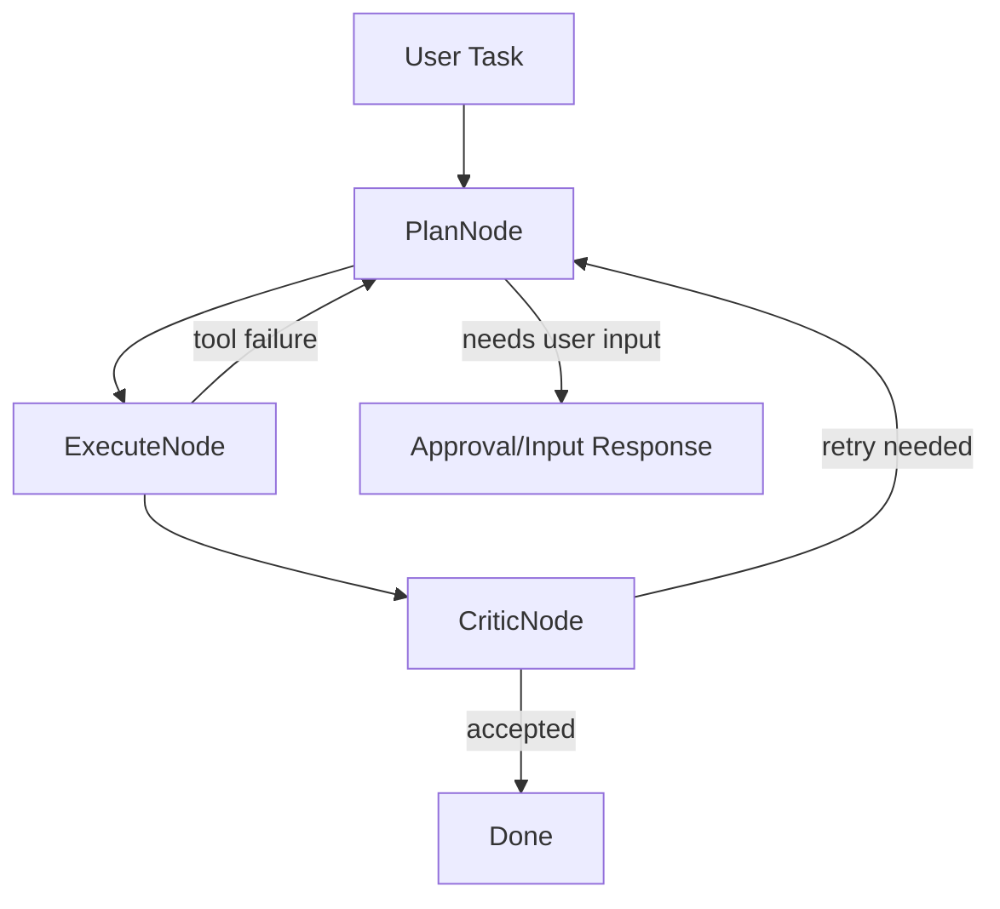

# AdaptiveAgent Architecture Blueprint

이 문서는 AdaptiveAgent의 큰 그림을 한눈에 보기 위한 설계 개요입니다. 세부 구현 방법, 필드 목록, 단계별 TODO는 `docs/basic_architecture_design.md`에 두고, 결정 변경과 회의록은 `docs/architecture_decision_log.md`에 둡니다.

## 한 줄 정의

AdaptiveAgent는 사용자의 자연어 작업을 받아, 기존 도구를 우선 재사용하고, 필요하면 안전하게 도구를 생성·검증·승인·저장하는 CLI 중심 적응형 에이전트입니다.

## 설계 목표

- 자연어 원문을 보존한다.
- 외부 에이전트 프레임워크에 핵심 제어 흐름을 맡기지 않는다.
- LLM은 계획, 코드 작성, 비판처럼 역할이 분명한 지점에서만 사용한다.
- 도구 실행은 샌드박스에서 관찰 가능한 결과로 남긴다.
- 생성 도구는 검증과 사용자 승인 후에만 장기 카탈로그에 저장한다.

## 목표 아키텍처

```text
User / CLI
  -> AdaptiveAgent
  -> StateMachineRouter
  -> AgentState
  -> Plan Agent
  -> Tool execution or Coder Agent
  -> Sandbox
  -> Critic Agent
  -> Human approval
  -> SkillCatalog
```

## 1차 구현 루프

상세 구현의 첫 목표는 전체 목표 아키텍처를 한 번에 완성하는 것이 아니라, 라우터가 `AgentState.next_node`를 기준으로 실제 노드 루프를 돌게 만드는 것입니다.



1차 구현 범위는 `plan -> execute -> critique -> done/error`입니다. 사용자 승인이나 추가 입력이 필요하면 상태와 응답을 반환하는 선에서 멈추고, CLI 세션 재개와 승인 입력 루프는 다음 단계에서 다룹니다.

## 목표 모듈 역할

| 영역 | 책임 |
| --- | --- |
| `AdaptiveAgent` | 외부 공개 API, LLM 계획 정규화, 기존 호환 계층 |
| `AgentState` | 사용자 입력, 계획, 실행 결과, 오류, reflection, 다음 노드 상태를 담는 공유 상태 |
| `StateMachineRouter` | `AgentState.next_node`를 기준으로 다음 실행 단계를 결정하는 오케스트레이터 |
| `Plan Agent` | 사용자 원문과 사용 가능한 도구를 보고 다음 action을 선택 |
| `Coder Agent` | 승인된 계획을 바탕으로 재사용 가능한 Python 도구 코드를 작성 또는 수정 |
| `Critic Agent` | 실행 결과를 원래 의도와 비교해 성공, 재시도, 사용자 입력 필요 여부를 판단 |
| `ToolRegistry` | 내장 도구와 명시 실행 가능한 도구를 등록하고 조회 |
| `LocalSandboxBackend` | 생성 코드와 명령을 격리된 프로세스에서 실행하고 stdout/stderr/timeout을 캡처 |
| `SkillCatalog` | 승인된 생성 도구 metadata를 `manifest.json`에 저장하는 장기 카탈로그 |

## 목표 데이터 흐름

1. 사용자가 CLI로 자연어 작업을 입력한다.
2. `AgentState`가 원문 입력과 실행 이벤트를 보존한다.
3. `Plan Agent`가 다음 action을 JSON으로 제안한다.
4. Router가 action을 기존 실행 계약으로 정규화한다.
5. 기존 도구가 있으면 바로 실행하고, 없으면 Coder 흐름으로 확장한다.
6. 샌드박스가 실행 결과와 오류를 관찰 가능한 형태로 반환한다.
7. Critic이 성공 여부와 재시도 가능성을 판단한다.
8. 생성 도구가 유용하면 사용자 승인을 요청한다.
9. 승인된 도구만 `SkillCatalog`에 등록되어 이후 검색 후보가 된다.

## Action 계약

Plan Agent는 다음 큰 action 중 하나를 반환한다.

| Action | 의미 |
| --- | --- |
| `use_tool` | 기존 도구를 실행한다 |
| `create_tool` | 새 재사용 도구 생성을 요청한다 |
| `approve_tool` | 검증된 생성 도구를 사용자 승인 후 catalog에 등록한다 |
| `final_answer` | 도구 없이 최종 답변을 반환한다 |
| clarification response | 정보가 부족해 사용자 입력을 요청한다 |

현재 구현은 하위 호환을 위해 기존 `tool` / `respond` 계약도 지원한다.

## 현재 구현 상태

현재 코드는 목표 아키텍처의 모든 루프를 완성한 상태가 아니라, 다음 경계를 우선 구현한 상태입니다.

| 상태 | 항목 |
| --- | --- |
| 구현됨 | `AgentState`, `StateMachineRouter`, `PlanNode`, Plan/Coder/Critic prompt 파일, `SkillCatalog`, 승인 후 manifest 등록 흐름 |
| 부분 구현 | Coder/Critic 노드 계약과 prompt |
| 아직 남음 | Coder/Critic 실제 LLM 호출 루프, HITL 재개 흐름, Top-K 검색 고도화, embedding 기반 retriever |

## 저장 정책

- `tool_create`: 생성 파일과 개별 metadata만 만든다.
- `tool_validate`: 샌드박스 검증 결과만 기록한다.
- `tool_approve`: 사용자 승인 후 `manifest.json`에 등록한다.
- `tool_search`: 승인되어 `manifest.json`에 있는 생성 도구만 검색 후보로 본다.

## 문서 역할

- 큰 그림: `docs/architecture_blueprint.md`
- 세부 설계: `docs/basic_architecture_design.md`
- 결정/회의록: `docs/architecture_decision_log.md`
- 요구사항 분해: `docs/requirements_breakdown.md`
- 검증 시나리오: `docs/adaptive_agent_validation_scenarios.md`
