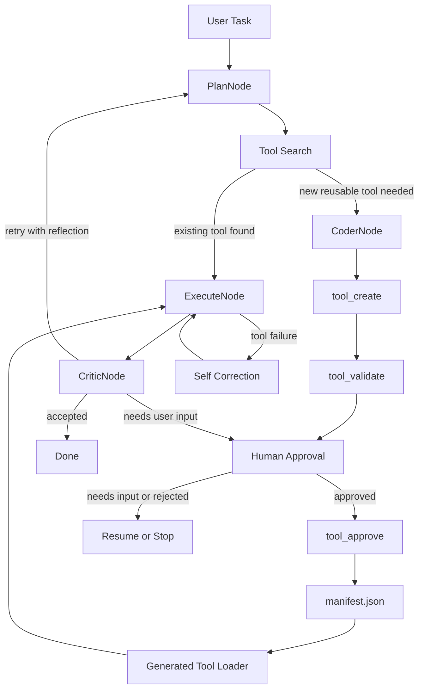

# AdaptiveAgent Architecture Blueprint

이 문서는 AdaptiveAgent의 큰 그림을 한눈에 보기 위한 설계 개요입니다. 세부 구현 방법, 필드 목록, 단계별 TODO는 `docs/basic_architecture_design.md`에 두고, 결정 변경과 회의록은 `docs/architecture_decision_log.md`에 둡니다.

## 한 줄 정의

AdaptiveAgent는 사용자의 자연어 작업을 받아, 기존 도구를 우선 재사용하고, 필요하면 안전하게 도구를 생성·검증·승인·저장하는 CLI 중심 적응형 에이전트입니다.

## 설계 목표

- 자연어 원문을 보존한다.
- 외부 에이전트 프레임워크에 핵심 제어 흐름을 맡기지 않는다.
- LLM은 계획, 코드 작성, 비판처럼 역할이 분명한 지점에서만 사용한다.
- 도구 실행은 샌드박스에서 관찰 가능한 결과로 남긴다.
- 생성 도구는 검증과 사용자 승인 후에만 장기 카탈로그에 저장한다.

## 목표 아키텍처

```text
User / CLI
  -> AdaptiveAgent
  -> StateMachineRouter
  -> AgentState
  -> SkillCatalog / ToolRegistry
  -> Plan / Coder / Executor / Critic / Librarian Agents
  -> LocalSandboxBackend
  -> Human approval / resume
  -> SkillCatalog(manifest.json)
```

## 다음 구현 루프

현재 다음 목표는 “계획을 한 번 실행하는 루프”를 “역할별 agent가 협업해 승인된 생성 툴을 이후 세션에서 실제로 재사용하는 루프”로 확장하는 것입니다. 라우터는 계속 `AgentState.next_node`를 기준으로 전이하되, Plan/Coder/Executor/Critic/Librarian 역할을 분리해 각 agent가 명확한 책임과 입출력 계약을 갖게 합니다.



이번 확장 범위는 `plan -> search/retrieve -> code or execute -> validate -> approve/resume -> register -> critique -> done/retry`입니다. multi-agent 분리는 이번 구현 목표로 포함하고, embedding 기반 검색과 강한 컨테이너 샌드박스는 장기 확장으로 남깁니다.

## 목표 모듈 역할

| 영역 | 책임 |
| --- | --- |
| `AdaptiveAgent` | 외부 공개 API, LLM 계획 정규화, 기존 호환 계층 |
| `AgentState` | 사용자 입력, 계획, 실행 결과, 오류, reflection, 다음 노드 상태를 담는 공유 상태 |
| `StateMachineRouter` | `AgentState.next_node`를 기준으로 역할별 agent 전이를 결정하는 오케스트레이터 |
| `Plan Agent` | 사용자 원문과 사용 가능한 도구를 보고 다음 action을 선택 |
| `Coder Agent` | 승인된 계획을 바탕으로 재사용 가능한 Python 도구 코드를 작성 또는 수정 |
| `Executor Agent` | 내장/생성 툴을 subprocess 경계에서 실행하고 stdout/stderr/exit code를 관찰 |
| `Critic Agent` | 실행 결과를 원래 의도와 비교해 성공, 재시도, 사용자 입력 필요 여부를 판단 |
| `Librarian Agent` | 승인된 생성 툴 metadata, manifest 정합성, 검색/중복/품질 지표를 관리 |
| `ToolRegistry` | 내장 도구와 명시 실행 가능한 도구를 등록하고 조회 |
| `LocalSandboxBackend` | 생성 코드와 명령을 격리된 프로세스에서 실행하고 stdout/stderr/timeout을 캡처 |
| `SkillCatalog` | 승인된 생성 도구 metadata를 `manifest.json`에 저장하고 Top-K 검색 후보를 제공하는 장기 카탈로그 |

## 목표 데이터 흐름

1. 사용자가 CLI로 자연어 작업을 입력한다.
2. `AgentState`가 원문 입력과 실행 이벤트를 보존한다.
3. `SkillCatalog`와 `ToolRegistry`가 내장 툴 및 승인된 생성 툴을 조회한다.
4. `Plan Agent`가 원문 task, available tools, retrieved skills를 보고 다음 action을 JSON으로 제안한다.
5. Router가 action을 내부 실행 계약으로 정규화하고 `next_node`를 결정한다.
6. 기존 도구가 있으면 `ExecuteNode`가 실행하고, 새 재사용 도구가 필요하면 `CoderNode`가 `run(arguments)` 코드를 생성한다.
7. 생성 코드는 `tool_create`와 `tool_validate`를 거쳐 샌드박스에서 검증된다.
8. 저장 또는 위험 작업은 HITL 승인 상태로 멈춘다. CLI는 기본적으로 새 session을 시작하고, 사용자가 명시적으로 요청할 때만 이전 session을 복구한다.
9. 승인된 생성 도구만 `manifest.json`에 등록되고, 다음 실행부터 generated tool loader가 `ToolRegistry`에 실행 가능한 툴로 올린다.
10. `Critic Agent`가 실행 결과를 원래 의도와 비교해 성공, 재시도, 사용자 입력 필요, 실패를 분류한다.
11. retry 시 Critic reflection과 이전 관찰 결과가 다음 planning context에 들어간다.

## Action 계약

Plan Agent는 다음 큰 action 중 하나를 반환한다.

| Action | 의미 |
| --- | --- |
| `use_tool` | 기존 도구를 실행한다 |
| `create_tool` | 새 재사용 도구 생성을 요청한다 |
| `approve_tool` | 검증된 생성 도구를 사용자 승인 후 catalog에 등록한다 |
| `final_answer` | 도구 없이 최종 답변을 반환한다 |
| clarification response | 정보가 부족해 사용자 입력을 요청한다 |

현재 구현은 하위 호환을 위해 기존 `tool` / `respond` 계약도 지원한다.

## 현재 구현 상태

라우터 + agents/ + manifest 등록 + HITL 재개까지 핵심 루프는 동작합니다. 남은 작업은 책임 분리·고도화·운영성 위주입니다.

| 상태 | 항목 |
| --- | --- |
| 구현됨 | `AgentState`, `StateMachineRouter`(retrieve→plan→{code\|execute}→critique 전이, max_steps 가드, unknown_next_node 폴백), `agents/` 5종(Plan/Coder/Executor/Critic/Librarian), Plan/Coder/Critic/Correction prompt 파일, `SkillCatalog`(키워드/태그/카테고리 가중치 Top-K, `record_usage`로 usage/failure 통계, `find_stale_entries`로 무결성 감사), 생성 툴 create/validate/approve/search built-in, 승인 후 manifest 등록 + hash mismatch/missing 차단을 거친 generated tool loader, HITL 재개(`agent.resume()` + `SessionStore.save_pending/load_pending/close` + CLI `--resume/--approve/--reject/--input`), Critic verdict→retry/approve/error 라우팅, 정책 차단의 `block_reason` 식별자(`workspace_path`/`sensitive_absolute_path`/`dangerous_shell_pattern`), CoderAgent의 `tool_create` 인자(name/description/code) 누락 검증 + `coder_arguments_invalid` 이벤트, `_run_normalized_plan` 1차 분해(`_execute_normalized_tool` + `_run_self_correction_loop` + `_ToolAttemptOutcome`), LibrarianAgent의 catalog 감사·`record_usage` 위임·`generated_tool_usage_recorded` 이벤트 |
| 부분 구현 | Critic reflection의 Plan 재활용(전달은 되지만 prompt가 실제로 활용하는지 단위 테스트로 잠그지 않음), `agent.py` 분해(`_run_normalized_plan`은 분해됐으나 plan normalization·prompt builders·response builders는 같은 파일 ~870줄에 남아있음), Librarian 중복 매니페스트 항목 병합(이름 충돌 시 정책 미정) |
| 아직 남음 | `_execute_normalized_tool`/`_run_self_correction_loop`을 `agents/executor.py`로 흡수해 router 다이어그램 모듈 경계와 일치시키기, 세션 디렉터리 cleanup 정책(TTL/카운트 cap), embedding 기반 Top-K 검색, 컨테이너 샌드박스(현재는 LocalSandboxBackend subprocess + temp dir), `artifact_store`·`web_fetch` 실구현, multi-agent 병렬화 |

> 마지막 갱신은 A4·A5·A3 1차 분해 + B5/B6 테스트 강화 도입(2026-05-02) 시점. 남은 항목은 GitHub Issues에서 추적합니다.

## 저장 정책

- `tool_create`: 생성 파일과 개별 metadata만 만든다.
- `tool_validate`: 샌드박스 검증 결과만 기록한다.
- `tool_approve`: 사용자 승인 후 `manifest.json`에 등록한다.
- `tool_search`: 승인되어 `manifest.json`에 있는 생성 도구만 검색 후보로 본다.
- generated tool loader: 검증·승인된 manifest 항목만 실행 가능한 `ToolRegistry` 항목으로 로드하고, 실행은 subprocess 경계를 유지한다.

## 문서 역할

- 큰 그림: `docs/architecture_blueprint.md`
- 세부 설계: `docs/basic_architecture_design.md`
- 결정/회의록: `docs/architecture_decision_log.md`
- 요구사항 분해: `docs/requirements_breakdown.md`
- 검증 시나리오: `docs/adaptive_agent_validation_scenarios.md`
