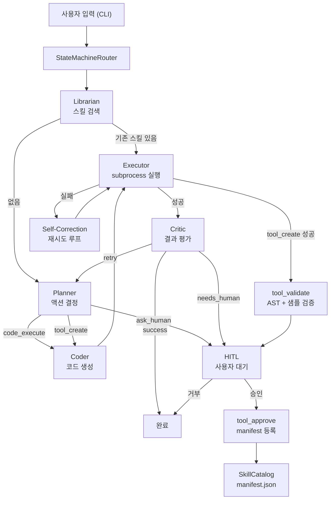

# AdaptiveAgent — 설계 근거 및 한계 분석

> **작성일**: 2026-05-03  
> **프로젝트**: AdaptiveAgent — 자연어 기반 동적 툴 생성·실행 에이전트 시스템

---

## 목차

1. [프로젝트 개요](#1-프로젝트-개요)
2. [설계 결정 사항](#2-설계-결정-사항)
   - 2-1. 외부 에이전트 프레임워크 비의존 원칙
   - 2-2. 상태 기계 기반 실행 흐름 (StateMachineRouter + AgentState)
   - 2-3. 역할 분리 아키텍처 (Plan / Coder / Critic)
   - 2-4. 프롬프트 외부화 및 파일 기반 관리
   - 2-5. 툴 생성 3단계 파이프라인 (Create → Validate → Approve)
   - 2-6. subprocess 기반 샌드박스 (컨테이너 격리 의도적 제외)
   - 2-7. SkillCatalog — 장기 스킬 메모리
   - 2-8. Human-in-the-Loop (HITL) 재개 흐름
3. [한계 및 개선 가능 방향](#3-한계-및-개선-가능-방향)
   - 3-1. 세션 장기화에 따른 컨텍스트 증가
   - 3-2. 스킬 자가 진화 (Self-Evolve) 미구현
   - 3-3. 샌드박스 격리 강도 한계
   - 3-4. 단일 사용자 세션 제약
   - 3-5. 역할별 LLM 고정 — 코더 특화 모델 미분리
   - 3-6. Critic의 정답 검증 한계

---

## 1. 프로젝트 개요

AdaptiveAgent는 사용자의 자연어 태스크를 입력받아, 필요한 Python 툴을 동적으로 생성하고 샌드박스 환경에서 실행하며, 검증을 거친 툴을 스킬 라이브러리에 저장해 이후 세션에서 재사용하는 CLI 기반 에이전트 시스템이다.

단순한 LLM 래퍼가 아니라, 실행·검증·승인·저장의 전 과정을 에이전트가 자율적으로 수행하되, 위험한 작업이나 불확실한 결정 지점에서는 반드시 사용자를 개입시키는 구조를 지향한다.

### 시스템 전체 흐름



### AAVS 검증 결과 (16개 시나리오 기준)

| 모델 | 점수 | 비고 |
|:-----|:----:|:-----|
| gpt-5.4-nano | **15 / 16** | AAVS-006만 잔존 (LLM 계획 오류) |
| gpt-5.4-mini | **15 / 16** | AAVS-011만 잔존 (LLM 계획 오류) |
| qwen3.5:2b | **9 / 16** | 코더 단계 집중 실패 |
| qwen3.5:4b | **9 / 16** | 동일 패턴, 모델 크기 무관 |
| qwen3.5:9b | **9 / 16** | 동일 패턴, 모델 크기 무관 |

---

## 2. 설계 결정 사항

---

### 2-1. 외부 에이전트 프레임워크 비의존 원칙

**결정**: LangChain, Claude Agent SDK 등 에이전트 프레임워크를 핵심 제어 흐름에 사용하지 않는다.

**이유**

에이전트의 핵심 가치는 **실행 중 어느 지점에서든 멈추고 재개할 수 있는 능력**에 있다. 툴 승인 대기, 위험 작업 감지, 정보 부족 시 사용자 질문 — 이런 상황에서 프레임워크가 제어 흐름을 소유하고 있으면 그 흐름에 개입하기 위해 프레임워크 내부를 뜯어야 한다.

직접 구현한 `StateMachineRouter`는 `AgentState.next_node`라는 단일 상태값으로 흐름을 결정한다. 어느 시점이든 상태를 스냅샷 찍어 저장하고, 나중에 해당 노드부터 재개하는 것이 구조적으로 자연스럽다.

**검증 근거**

AAVS 16개 시나리오 중 AAVS-016~018(스킬 검색·다중 스킬·세션 지속성)은 4개 모델 전부 100% 통과했다. 복잡한 재개 흐름이 외부 의존 없이 동작한다는 것을 실측으로 확인했다.

**트레이드오프**

빠른 프로토타입 제작 시간이 길어진다. 프레임워크가 제공하는 도구 호출, 메모리 관리, 스트리밍 연동 등을 직접 구현해야 한다.

---

### 2-2. 상태 기계 기반 실행 흐름

**결정**: 에이전트의 실행 흐름을 `StateMachineRouter`와 `AgentState`의 조합으로 구현한다.

**구조**

```
AgentState
  ├── user_task        : 원본 사용자 입력 (변경 금지)
  ├── current_plan     : 현재 실행 계획 (JSON)
  ├── last_tool_result : 직전 실행 결과
  ├── error_log        : 누적 에러 문자열
  ├── reflections      : Critic이 남긴 교훈 목록
  ├── events           : 전체 실행 이벤트 타임라인
  └── next_node        : 다음에 실행할 노드 이름
```

`StateMachineRouter`는 `next_node`만 보고 다음 역할 에이전트를 호출한다. 각 에이전트는 상태를 읽고 쓰되 다른 에이전트를 직접 호출하지 않는다.

**이유**

단방향 데이터 흐름을 유지하면 실패 원인을 이벤트 타임라인으로 추적할 수 있다. 실제로 AAVS 검증에서 `plan_validation_failed`, `failure_classified`, `execution_critiqued` 이벤트 순서를 분석해 "플래너 실패인지, 코더 실패인지, Critic 과잉 retry인지"를 정확히 구분할 수 있었다.

**한계**

`AgentState`가 점점 비대해지고 있다. 세션이 길어질수록 `events` 리스트와 `reflections`가 누적된다. 특정 필드가 어느 노드에서 쓰이는지 명확하지 않은 부분이 있고, 병렬 실행 시 상태 충돌 가능성이 잠재적으로 존재한다.

---

### 2-3. 역할 분리 아키텍처

**결정**: Plan(무엇을 할지) / Coder(어떻게 구현할지) / Critic(결과가 좋은지) 세 역할을 독립적인 에이전트로 분리한다.

**이유**

계획 수립과 코드 구현은 LLM에게 요구하는 역량이 다르다. 하나의 LLM 호출로 "계획을 JSON으로 내고 동시에 Python 코드를 작성하라"고 요구하면 두 가지 문제가 발생한다.

첫째, **소형 모델에서 포맷 불안정성**이 심화된다. AAVS 테스트에서 qwen3.5 계열은 plan과 code를 동시에 요구할 때 JSON이 잘리거나 이중 인코딩되는 현상이 반복 관찰됐다. 역할을 분리하면 각 LLM 호출이 단순해지고 포맷 안정성이 높아진다.

둘째, **역할별로 다른 모델을 사용하는 구조가 불가능**해진다. 플래너는 빠른 소형 모델로, 코더는 코딩 특화 모델로 교체하는 최적화가 역할 분리 없이는 어렵다.

**AAVS 검증에서 도출된 근거**

qwen3.5 계열의 실패 7건 전부가 Coder 단계에서 발생했다. 플래너가 `code_execute`나 `tool_create`를 올바르게 선택하는 비율은 높았다. 이는 같은 모델이라도 역할에 따라 성능 차이가 있음을 보여주며, 역할 분리의 실용적 가치를 뒷받침한다.

| 역할 | qwen3.5 성공률 | 비고 |
|:-----|:---:|:-----|
| Planner (tool 선택) | 높음 | 단순 JSON 포맷, 안정적 |
| Coder (Python 생성) | 낮음 | 이중인코딩, 논리 오류 다수 |
| Critic (결과 평가) | 높음 | 이진 판정, 포맷 단순 |

---

### 2-4. 프롬프트 외부화 및 파일 기반 관리

**결정**: 역할별 시스템 프롬프트를 코드와 분리하여 `adaptive_agent/prompts/default/*.txt`에 관리한다.

**이유**

프롬프트는 LLM 동작을 결정하는 핵심 요소인데, 동시에 가장 자주 수정되는 부분이다. 코드에 하드코딩하면 프롬프트를 고칠 때마다 코드 배포가 필요하고, 변경 이력도 코드 diff에 묻힌다.

파일로 분리하면:
- 코드 배포 없이 프롬프트 실험 가능
- A/B 테스트 시 버전 비교가 명확
- `prompts/openai/`, `prompts/ollama-general/` 같은 provider별 분기를 `PromptLoader`의 fallback 체인으로 지원 가능

**실제 활용**

AAVS 검증 사이클 동안 `coder.txt`, `correction.txt`, `critic.txt`를 수십 회 수정했다. 코드 변경 없이 프롬프트만 교체하고 재실행하는 사이클이 검증 속도를 크게 높였다.

---

### 2-5. 툴 생성 3단계 파이프라인

**결정**: LLM이 생성한 툴은 `tool_create → tool_validate → tool_approve` 3단계를 반드시 거친 후에만 스킬 라이브러리에 등록된다.

**각 단계의 역할**

| 단계 | 역할 | manifest 상태 |
|:-----|:-----|:---:|
| `tool_create` | Python 파일 생성, AST 구문 검사 | 미등록 |
| `tool_validate` | subprocess 샌드박스에서 샘플 실행 검증 | 미등록 |
| `tool_approve` | 사용자 명시적 승인 | **등록** |

**이유**

LLM이 생성한 코드를 검증 없이 실행하거나 저장하는 것은 두 가지 위험을 내포한다.

첫째, **실행 안전성 문제**. LLM은 문법적으로 맞지만 의도치 않은 파일 시스템 접근, 무한 루프, 잘못된 API 호출을 포함한 코드를 생성할 수 있다.

둘째, **스킬 라이브러리 품질 저하**. EvolveTool-Bench(2026) 연구에서 검증 없이 생성된 툴을 축적하면 중복과 버그가 누적되고 라이브러리 전체의 신뢰도가 낮아진다는 것이 실험적으로 확인됐다.

`tool_approve` 단계에서 사용자가 명시적으로 결정하도록 한 것은 **에이전트의 장기 메모리 구성을 사용자가 통제**하도록 하기 위함이다. 에이전트가 알아서 모든 것을 결정하는 방향보다 중요한 결정 지점에서 인간이 개입하는 구조를 우선했다.

---

### 2-6. subprocess 기반 샌드박스

**결정**: 코드 실행 환경으로 `LocalSandboxBackend`(subprocess)만 구현한다. Docker 컨테이너 격리는 현재 설계에서 의도적으로 제외한다.

**이유**

에이전트를 사용하는 환경은 단일하지 않다. 로컬 개발자, CI/CD 파이프라인, 클라우드 서비스 배포 — 각 환경마다 적합한 격리 수준이 다르다. Docker를 강제하면 Docker가 없는 환경에서 설치 진입 장벽이 생기고, 특히 로컬 Ollama 기반 개발 사이클에서 Docker 오버헤드가 불필요하다.

현재 subprocess 샌드박스는 `SandboxBackend` 인터페이스를 통해 추상화되어 있다. 운영 환경이 확정되면 `DockerSandboxBackend`, `gVisorSandboxBackend` 등을 인터페이스를 구현하는 방식으로 교체 가능하다.

**현재 샌드박스의 보안 경계**

```
차단: workspace_path 외부 파일 접근, dangerous_shell_pattern (rm -rf 등), sensitive_absolute_path
미차단: 네트워크 접근, 프로세스 생성, 제한 없는 메모리 사용
```

이 수준의 격리는 신뢰할 수 있는 개발 환경 전제 하에서만 안전하다.

---

### 2-7. SkillCatalog — 장기 스킬 메모리

**결정**: 승인된 생성 툴을 `manifest.json`에 저장하고, Top-K 검색으로 세션 간 재사용한다.

**구조**

```
manifest.json (SkillCatalog)
  └── {tool_name}
       ├── description, parameters, returns
       ├── file_hash           ← 파일 위변조 감지
       ├── validated, approved ← 상태 추적
       ├── embedding           ← 코사인 유사도 검색용
       ├── usage_count         ← 사용 통계
       └── failure_count       ← 품질 모니터링
```

**이유**

에이전트가 매번 새로 툴을 생성하는 것은 비효율적이고 일관성이 없다. SkillX(2026) 연구가 제시하는 "플러그 앤 플레이 스킬 지식 기반" 개념처럼, 한 번 검증된 툴이 이후 세션에서 검색·재사용되어야 에이전트의 장기적 학습이 가능하다.

검색은 키워드 + 태그 기반 Top-K와 OpenAI embedding 코사인 유사도를 병행한다. OpenAI API key가 없으면 키워드 검색으로 폴백한다.

`usage_count`와 `failure_count`를 기록하는 것은 향후 스킬 품질 모니터링과 자가 진화의 기반 데이터다.

---

### 2-8. Human-in-the-Loop 재개 흐름

**결정**: 툴 승인, 위험 작업 감지, 정보 부족의 세 경우에 실행을 중단하고 사용자 응답을 기다린다. 프로세스가 종료됐다가 다시 시작해도 해당 지점부터 재개 가능하다.

**구현 방식**

```
실행 중단
  → AgentState 스냅샷 → SessionStore.save_pending(session_id)

재개
  --resume session_id  → SessionStore.load_pending()
  --approve / --reject → HITL 결과 주입
  --input "답변"       → ask_human 결과 주입
```

**이유**

CLI 기반 에이전트에서 "사용자가 응답을 줄 때까지 기다린다"는 것은 단순히 `input()` 호출이 아니다. 사용자가 에이전트를 종료했다가 나중에 다시 접속해서 이어가는 시나리오를 지원해야 한다. 이를 위해 pending 상태를 파일에 직렬화하고, session_id로 복구하는 구조를 선택했다.

---

## 3. 한계 및 개선 가능 방향

---

### 3-1. 세션 장기화에 따른 컨텍스트 증가

**현재 상태**

`AgentState.reflections`, 이벤트 로그, `last_tool_result`는 세션이 길어질수록 누적된다. 이것이 각 LLM 호출의 컨텍스트에 포함되기 때문에, 세션이 길어질수록 호출 비용과 응답 지연이 증가하고 소형 모델에서는 포맷 안정성이 저하된다.

실제로 qwen3.5 계열에서 correction 맥락이 길어질 때 `plan_not_object` 오류가 증가하는 현상이 AAVS 테스트에서 관찰됐다.

**개선 방향**

**Memory Compact**: 일정 threshold를 넘으면 오래된 reflection과 이벤트를 요약·압축한다. 예를 들어 마지막 3개 reflection은 그대로 유지하고, 이전 것들은 "요약: [핵심 교훈]" 형태로 압축한다.

**Context Budget 관리**: 모델별 최대 컨텍스트 토큰 수를 `config.py`에 정의하고, 프롬프트 렌더링 시 우선순위가 낮은 정보(오래된 이벤트, 사용된 reflection)를 제외한다. `PromptLoader.render()`에 budget 파라미터를 추가하는 방식으로 구현 가능하다.

---

### 3-2. 스킬 자가 진화 (Self-Evolve) 미구현

**현재 상태**

툴이 한 번 `tool_approve`로 등록되면 이후 변경이 없다. 특정 입력에서 실패하거나 더 나은 구현이 가능한 경우에도 자동 갱신 메커니즘이 없다.

`failure_count`를 이미 기록하고 있지만, 이를 활용하는 트리거 로직이 구현되지 않았다.

**개선 방향**

AgentEvolver(2025)가 제시하는 상향식 스킬 진화 방향을 점진적으로 도입할 수 있다.

단기: `failure_count >= N`이거나 오래된 스킬(`last_used`가 임계값 초과)에 대해 Librarian이 "재작성 제안" 이벤트를 발행하고, 사용자 확인 후 새 버전을 생성·재검증하는 흐름.

중기: 기능이 겹치는 스킬을 자동 감지(`embedding` 유사도 기반)해 병합 또는 제거를 제안한다. EvolveTool-Bench가 지적한 "라이브러리 오염" 문제를 선제적으로 방지한다.

---

### 3-3. 샌드박스 격리 강도 한계

**현재 상태**

`LocalSandboxBackend`는 subprocess 수준의 격리만 제공한다. 생성 코드가 네트워크를 사용하거나 허용된 경로 밖의 파일에 접근하는 것을 완전히 차단하지 못한다. 현재 구현은 정책 기반 패턴 매칭으로 위험 패턴을 감지하는 방어 수준이다.

**개선 방향**

`SandboxBackend` 인터페이스가 이미 추상화되어 있어, 배포 환경이 확정되면 강도 높은 격리를 끼워 넣는 것이 구조적으로 가능하다.

| 환경 | 권장 샌드박스 |
|:-----|:------------|
| 로컬 개발 | LocalSandboxBackend (현재) |
| 팀 공유 서버 | Docker + 네트워크 비활성화 |
| 클라우드 서비스 | gVisor, Firecracker, Kata Containers |
| CI/CD | 전용 컨테이너 이미지 |

중요한 것은 어떤 환경에서 운영할지에 따라 격리 수준이 달라지므로, 이를 설계 단계에서 고정하지 않고 인터페이스 교체로 대응하는 현재 방향이 맞다.

---

### 3-4. 단일 사용자 세션 제약

**현재 상태**

현재 세션 관리는 단일 workspace 기준으로 동작한다. 사용자 구분, 사용자별 스킬 라이브러리 격리, 접근 권한 관리가 없다.

이는 의도적인 결정이다. 사용자 관리는 에이전트 기능이 아니라 서비스 인프라 문제이며, 핵심 에이전트 동작이 검증되기 전에 인프라 설계를 앞세우는 것은 비효율적이라 판단했다.

**개선 방향**

서비스 형태로 전환할 때 고려할 요소:

- **사용자 식별**: JWT 또는 세션 토큰 기반 사용자 구분
- **스킬 격리**: 개인 스킬(private manifest) + 공유 스킬(org manifest) 계층 구조
- **권한 관리**: 위험 툴 실행 권한, 특정 파일시스템 접근 권한
- **다중 세션**: `session_id`는 이미 UUID 기반이므로 다중 세션 지원은 SessionStore 수준에서 확장 가능

---

### 3-5. 역할별 LLM 고정 — 코더 특화 모델 미분리

**현재 상태**

플래너, 코더, 크리틱이 동일한 모델을 사용한다. 이것이 qwen3.5 계열에서 심각한 성능 병목이 된다.

```
AAVS 검증: qwen3.5 실패 7건 전부 → Coder 단계
플래너의 tool 선택 정확도 → 높음
코더의 Python 코드 생성 품질 → 낮음
```

모델 크기를 2b → 4b → 9b로 늘려도 동일한 9/16 결과가 반복됐다. 이는 모델 크기가 아니라 **모델 종류(general vs coding-specialized)의 문제**임을 확인한 것이다.

**개선 방향**

`config.py`에 `coder_provider`와 `coder_model` 필드를 추가하고, `_code_with_llm`에 별도 LLM 클라이언트를 주입하는 방식으로 구현한다. 기존 코드 변경 범위가 작다.

```python
# config.py 추가 예시
coder_provider: str = ""   # 비어 있으면 llm_provider를 따름
coder_model: str = ""      # 비어 있으면 기본 모델을 따름
```

**예상 조합 및 효과**

| 조합 | 예상 효과 |
|:-----|:---------|
| Planner: qwen3.5:2b + Coder: qwen2.5-coder:7b | 로컬 전용, 코더 품질 향상 |
| Planner: qwen3.5:2b + Coder: gpt-5.4-nano | 플래너 로컬, 코더 API |
| 전체: gpt-5.4-mini | 현재 최고 성능 (15/16) |

---

### 3-6. Critic의 정답 검증 한계

**현재 상태**

Critic의 판정 기준: "실행이 성공(exit_code=0)하고 JSON 출력이 있으면 success"

이것이 현재 Critic의 근본적 한계다. 코드가 실행은 됐지만 결과가 태스크 요구사항과 다른 경우를 잡지 못한다.

**AAVS 실측 사례**

AAVS-007 (qwen3.5:9b): 전체 학생 총점 350, 평균 87.5를 요구했는데, qwen이 최고점 학생만 필터한 후 합산해 `total=190, average=95.0`을 출력했다. Critic은 이를 success로 통과시켰다.

| 항목 | 요구값 | qwen 출력 | Critic 판정 |
|:-----|:------:|:---------:|:-----------:|
| total_score | 350 | 190 | **success** |
| average_score | 87.5 | 95.0 | **success** |

**개선 방향**

완전한 자동 검증은 불가능하다. 그러나 다음 두 가지 수준의 개선은 현실적이다.

**수준 1 — Critic 프롬프트 강화**: task 원문과 실행 결과를 같이 주고 "입력 데이터와 출력이 의미적으로 일치하는지" 확인하도록 critic.txt를 개선한다. 숫자 범위 이탈, 빈 결과, 요청된 필드 누락 같은 명백한 오류는 프롬프트 수준에서 잡을 수 있다.

**수준 2 — 검증 가능한 태스크에 한해 자동 검증 추가**: 특정 AAVS 시나리오처럼 기대 출력이 정의 가능한 경우, Executor가 실행 후 기대값과 대조하는 `assertion_check` 단계를 선택적으로 추가한다.

---

## 참고 문헌

| 논문 | 관련 설계 항목 |
|:-----|:-------------|
| SkillX (2026) | SkillCatalog 다층 스킬 구조 |
| EvolveTool-Bench (2026) | 툴 라이브러리 품질 관리, 3단계 파이프라인 |
| AgentEvolver / Bottom-Up Skill Evolution (2025) | Self-Evolve 개선 방향 |
| A Probabilistic Inference Scaling Theory for LLM Self-Correction (EMNLP 2025) | Self-Correction 임계점 설계 |
| Which Agent Causes Task Failures (2025) | 역할 분리 및 실패 귀인 구조 |
| Model Context Protocol (MCP, 2024~) | 툴 인터페이스 표준화 참고 |
