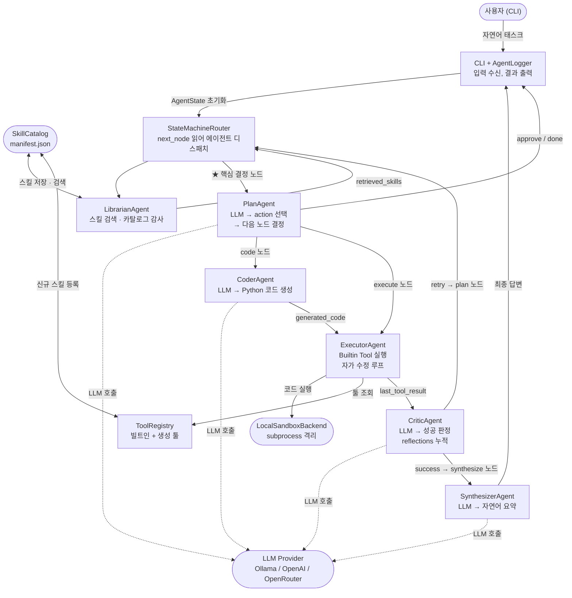

# AdaptiveAgent — 시스템 설계 및 기술 보고서

> **작성일**: 2026-05-04
> **프로젝트**: AdaptiveAgent — 자연어 기반 동적 툴 생성·실행 멀티 에이전트 시스템

---

## 목차

- [1. 프로젝트 개요](#1-프로젝트-개요)
- [2. 시스템 아키텍처](#2-시스템-아키텍처)
  - [2-1. 에이전트 구성 및 역할](#2-1-에이전트-구성-및-역할)
  - [2-2. 실행 흐름 — FSM 기반 파이프라인](#2-2-실행-흐름--fsm-기반-파이프라인)
  - [2-3. AgentState — 에이전트 간 데이터 계약](#2-3-agentstate--에이전트-간-데이터-계약)
  - [2-4. 프롬프트 설계 체계](#2-4-프롬프트-설계-체계)
- [3. 설계 결정 사항](#3-설계-결정-사항)
- [4. 한계 및 개선 가능 방향](#4-한계-및-개선-가능-방향)
- [5. 환경 설정 및 실행 방법](#5-환경-설정-및-실행-방법)
  - [5-1. 환경 요구사항 및 설치 (Poetry)](#5-1-환경-요구사항-및-설치)
  - [5-8. CLI 옵션별 실행 가이드](#5-8-cli-옵션별-실행-가이드)
- [참고 문헌](#참고-문헌)

---

## 1. 프로젝트 개요

AdaptiveAgent는 사용자의 자연어 태스크를 입력받아 Python 툴을 동적으로 생성·실행·검증하고, 승인된 툴을 스킬 라이브러리에 저장해 이후 세션에서 재사용하는 CLI 기반 멀티 에이전트 시스템이다.

시스템은 아래 원칙 하에 설계됐다.

**원칙 1 — 역할 분리 (Separation of Concerns)**: 계획(Plan)·구현(Code)·실행(Execute)·평가(Critique)를 독립 에이전트로 분리한다. 동일한 LLM이 코드를 생성하고 스스로 평가하면 자기 평가 편향(Self-Evaluation Bias)으로 오류 검출률이 낮아진다. 역할 분리는 이 구조적 한계를 해소하고, 에이전트가 자신의 출력을 비판적으로 검토하는 구조를 만든다.

**원칙 2 — 인간 개입 설계 (Human-in-the-Loop)**: 에이전트는 자율적으로 실행하되, 위험 작업·정보 부족의 세 지점에서 반드시 멈추고 사용자 확인을 기다린다. 에이전트의 장기 메모리(SkillCatalog)는 사용자가 승인한 것만 포함한다.

---

## 2. 시스템 아키텍처

### 2-1. 멀티 에이전트 구조도



**PlanAgent가 핵심 결정 노드인 이유**: LLM 출력에서 action을 해석해 다음에 실행할 에이전트를 직접 결정한다. `code_execute/tool_create → code 노드(CoderAgent)`, `tool/parallel → execute 노드(ExecutorAgent)`, `needs_user_input → approve`, `respond → done`. 이 routing의 정확도가 전체 파이프라인 성패를 좌우한다.

---

### 2-2. 에이전트 역할

| 에이전트 | 노드 | LLM | 책임 |
|:---------|:----:|:---:|:-----|
| **LibrarianAgent** | `retrieve` | ✗ | SkillCatalog 검색, stale 항목 감지 |
| **PlanAgent** | `plan` | ✓ | action 결정 + **다음 노드 routing** (오케스트레이터) |
| **CoderAgent** | `code` | ✓ | Mode A: 인라인 스크립트 / Mode B: `def run()` 함수 생성 |
| **ExecutorAgent** | `execute` | ✗ | 빌트인·생성 툴 실행, 병렬 실행, 자가 수정 루프 |
| **CriticAgent** | `critique` | ✓ | 성공/재시도/에스컬레이션 판정, reflections 누적 |
| **SynthesizerAgent** | `synthesize` | ✓ | 실행 결과 자연어 요약, code_save 플래그 |

> CoderAgent는 `ADAPTIVE_AGENT_CODER_LLM` / `ADAPTIVE_AGENT_CODER_MODEL`로 전용 모델 분리 가능.

---

### 2-3. 빌트인 툴

ExecutorAgent가 실행할 수 있는 툴은 두 종류다: **빌트인**(코드에 내장)과 **생성 툴**(사용자 승인 후 SkillCatalog에 등록).

**빌트인 툴 목록**

| 카테고리 | 툴 | 설명 |
|:---------|:---|:-----|
| **실행** | `code_execute` | Python 인라인 스크립트를 샌드박스에서 실행 |
| | `shell_run` | 쉘 명령어 실행 (위험 패턴 필터링) |
| **파일** | `file_read` | workspace 내 파일 읽기 |
| | `file_write` | workspace 내 파일 쓰기 |
| | `file_list` | 디렉터리 목록 조회 |
| | `file_patch` | 파일 부분 수정 (unified diff) |
| **툴 생명주기** | `tool_create` | 생성 툴 파일 생성 + AST 검사 |
| | `tool_validate` | 샘플 인자로 생성 툴 실행 검증 |
| | `tool_approve` | 사용자 승인 후 manifest 등록 |
| | `tool_search` | SkillCatalog 키워드/임베딩 검색 |
| | `generated_tool_execute` | 등록된 생성 툴 동적 실행 |
| **HITL** | `ask_human` | 사용자에게 추가 정보 요청 |
| | `propose_actions` | 사용자에게 선택지 제시 |
| **스킬 관리** | `skill_list` | 등록된 스킬 목록 조회 |
| | `skill_delete` | 스킬 삭제 |
| **저장** | `memory_read` / `memory_write` | 키-값 세션 메모리 읽기·쓰기 |
| | `artifact_store` | 실행 아티팩트 파일 저장 |

---

### 2-4. 프롬프트 설계

역할별 프롬프트를 `adaptive_agent/prompts/default/*.txt`에 코드와 분리해 관리한다.

| 프롬프트 | 주요 입력 | 출력 형식 |
|:---------|:---------|:---------|
| `plan.txt` | `{task}`, `{retrieved_skills}`, `{conversation_history}`, `{last_tool_result}`, `{reflections}`, `{available_tools}` | `{"action":..., "reasoning":...}` |
| `coder.txt` | `{plan}`, `{task}`, `{observations}` | `{"code":...}` |
| `critic.txt` | `{task}`, `{current_plan}`, `{last_tool_result}`, `{reflections}`, `{error_log}` | `{"verdict":..., "reflection":..., "next_node":...}` |
| `correction.txt` | `{task}`, `{failed_plan}`, `{error}`, `{output}` | `{"action":..., "tool_name":...}` |
| `synthesize.txt` | `{task}`, `{tool_name}`, `{stdout}`, `{generated_code}`, `{language}` | 자연어 문장 |

**설계 원칙**

1. **reasoning 필수 (Chain-of-Thought)**: `plan.txt`는 모든 응답에 `"reasoning"` 필드를 필수 요구. 행동 선택 전 이유를 서술하면 routing 품질이 향상되고, 터미널 `💭` 라인으로 에이전트 판단 근거가 실시간 노출된다.
2. **대조 예시 (Contrastive Prompting)**: WRONG/RIGHT 형식으로 소형 모델의 이중 인코딩·markdown fence 삽입 같은 반복적 포맷 오류를 프롬프트 수준에서 선제 차단한다. OpenAI Codex 가이드, SWE-agent(Princeton NLP, 2024) 동일 패턴.


## 3. 설계 결정 사항


---

### 3-1. 상태 기계 기반 실행 흐름

**결정**: 에이전트의 실행 흐름을 `StateMachineRouter`와 `AgentState`의 조합으로 구현한다.

**구조**

```
AgentState  (단일 턴 범위)
  ├── user_task        : 원본 사용자 입력 (변경 금지)
  ├── retrieved_skills : Librarian이 채움 → Planner가 읽음
  ├── current_plan     : Planner가 채움 → Coder·Executor가 읽음
  ├── generated_code   : Coder가 채움 → Critic·Synthesizer가 읽음
  ├── last_tool_result : Executor가 채움 → Critic·Synthesizer가 읽음
  ├── reflections      : Critic이 누적 → Planner가 재계획 시 읽음 (피드백 루프)
  ├── events           : 모든 노드가 기록 → 실행 타임라인
  └── next_node        : 모든 노드가 결정 → Router가 읽음

ConversationSession  (멀티턴 세션 범위, conversation.py)
  ├── history          : 턴 간 누적 대화 (Message 리스트)
  └── pending_action   : 승인 대기 중인 액션 (tool_approve / ask_human)
```

`AgentState`의 핵심 설계 원칙: **각 필드는 정확히 하나의 노드가 쓰고(write), 이후 노드들이 읽는(read) 단방향 계약**이다. 유일한 예외는 `reflections`로, Critic이 쓰고 Planner가 읽는 피드백 루프를 형성한다.

```
Librarian  →  retrieved_skills  →  Planner
Planner    →  current_plan      →  Coder, Executor
Coder      →  generated_code    →  Executor, Critic, Synthesizer
Executor   →  last_tool_result  →  Critic, Synthesizer
Critic     →  reflections       →  Planner (피드백), next_node → Router
```

`StateMachineRouter`는 `next_node`만 보고 다음 에이전트를 호출한다. 에이전트들은 서로를 직접 호출하지 않는다. 이 **직접 결합(direct coupling) 없는 설계**가 각 노드를 독립적으로 테스트·교체 가능하게 만든다.

**이유**

단방향 데이터 흐름이 실패 귀인(failure attribution)을 자동으로 가능하게 한다. 어떤 노드가 실패했는지는 `events` 타임라인에서 즉시 확인된다. AAVS 검증에서 `plan_validation_failed`, `execution_critiqued`, `failure_classified` 이벤트 순서만 보고 "플래너 실패인지, 코더 실패인지, Critic 과잉 retry인지"를 구분했다.

**한계**

`AgentState`가 모든 노드의 공유 데이터 버스이기 때문에, 병렬 실행 시 상태 mutation 충돌 가능성이 있다. 현재는 병렬 실행 시 `last_tool_result` 등 단일값 필드 쓰기를 의도적으로 막고 `parallel_results` 리스트로 대신한다.

---


### 3-2. 역할 분리 아키텍처 — 자기 평가 편향 방지

**결정**: Plan(무엇을 할지) / Coder(어떻게 구현할지) / Critic(결과가 좋은지) 세 역할을 독립적인 에이전트로 분리한다.

**이유**

계획 수립과 코드 구현은 LLM에게 요구하는 역량이 다르다. 하나의 LLM 호출로 "계획을 JSON으로 내고 동시에 Python 코드를 작성하라"고 요구하면 두 가지 문제가 발생한다.

첫째, **소형 모델에서 포맷 불안정성**이 심화된다. AAVS 테스트에서 qwen3.5 계열은 plan과 code를 동시에 요구할 때 JSON이 잘리거나 이중 인코딩되는 현상이 반복 관찰됐다. 역할을 분리하면 각 LLM 호출이 단순해지고 포맷 안정성이 높아진다.

둘째, **역할별로 다른 모델을 사용하는 구조가 불가능**해진다. 플래너는 빠른 소형 모델로, 코더는 코딩 특화 모델로 교체하는 최적화가 역할 분리 없이는 어렵다.

**AAVS 검증에서 도출된 근거**

qwen3.5 계열(2b, 4b, 9b) 의 실패 7건 전부가 Coder 단계에서 발생했다. 플래너가 `code_execute`나 `tool_create`를 올바르게 선택하는 비율은 높았다. 이는 같은 모델이라도 역할에 따라 성능 차이가 있음을 보여주며, 역할 분리의 실용적 가치를 뒷받침한다.

| 역할 | qwen3.5 성공률 | 비고 |
|:-----|:---:|:-----|
| Planner (tool 선택) | 높음 | 단순 JSON 포맷, 안정적 |
| Coder (Python 생성) | 낮음 | 이중인코딩, 논리 오류 다수 |
| Critic (결과 평가) | 높음 | 이진 판정, 포맷 단순 |

---

### 3-3. 프롬프트 외부화 및 파일 기반 관리

**결정**: 역할별 시스템 프롬프트를 코드와 분리하여 `adaptive_agent/prompts/default/*.txt`에 관리한다.

**이유**

프롬프트는 LLM 동작을 결정하는 핵심 요소인데, 동시에 가장 자주 수정되는 부분이다. 코드에 하드코딩하면 프롬프트를 고칠 때마다 코드 배포가 필요하고, 변경 이력도 코드 diff에 묻힌다.

파일로 분리하면:
- 코드 배포 없이 프롬프트 실험 가능
- A/B 테스트 시 버전 비교가 명확
- `prompts/openai/`, `prompts/ollama-general/` 같은 provider별 분기를 `PromptLoader`의 fallback 체인으로 지원 가능 (현재는 model별 fallback 체인을 사용하고 있지 않음)

---

### 3-4. subprocess 기반 샌드박스

**결정**: 코드 실행 환경으로 `LocalSandboxBackend`(subprocess)만 구현한다. Docker 컨테이너 격리는 현재 설계에서 의도적으로 제외한다.

//ollama와의 관계 보다는 이게 실제 개발 환경 실제 사용 환경에 따라 가상 환경 구축이나 실행 환경 맞추는게 달라질거 같아서. 지금은 코어 부분을 선구현하고 개발환경은 타겟?이 정해지면 될거 같아서임. 

---

### 3-5. SkillCatalog — 장기 스킬 메모리

**결정**: 승인된 생성 툴을 `manifest.json`에 저장하고, Top-K 검색으로 세션 간 재사용한다.

**구조**

```
manifest.json (SkillCatalog)
  └── {tool_name}
       ├── description, parameters, returns
       ├── file_hash           ← 파일 위변조 감지
       ├── validated, approved ← 상태 추적
       ├── embedding           ← 코사인 유사도 검색용
       ├── usage_count         ← 사용 통계
       └── failure_count       ← 품질 모니터링
```

**이유**

에이전트가 매번 새로 툴을 생성하는 것은 비효율적이고 일관성이 없다. SkillX(2026) 연구가 제시하는 "플러그 앤 플레이 스킬 지식 기반" 개념처럼, 한 번 검증된 툴이 이후 세션에서 검색·재사용되어야 에이전트의 장기적 학습이 가능하다.

검색은 키워드 + 태그 기반 Top-K와 OpenAI embedding 코사인 유사도를 병행한다. OpenAI API key가 없으면 키워드 검색으로 폴백한다.

`usage_count`와 `failure_count`를 기록하는 것은 향후 스킬 품질 모니터링과 자가 진화의 기반 데이터다.

---

---

## 4. 한계 및 개선 가능 방향

---

### 4-1. 세션 장기화에 따른 컨텍스트 증가

**현재 상태**

`AgentState.reflections`, 이벤트 로그, `last_tool_result`는 세션이 길어질수록 누적된다. 이것이 각 LLM 호출의 컨텍스트에 포함되기 때문에, 세션이 길어질수록 호출 비용과 응답 지연이 증가하고 소형 모델에서는 포맷 안정성이 저하된다.

실제로 qwen3.5 계열에서 correction 맥락이 길어질 때 `plan_not_object` 오류가 증가하는 현상이 AAVS 테스트에서 관찰됐다.

**개선 방향**

**Memory Compact**: 일정 threshold를 넘으면 오래된 reflection과 이벤트를 요약·압축한다. 예를 들어 마지막 3개 reflection은 그대로 유지하고, 이전 것들은 "요약: [핵심 교훈]" 형태로 압축한다.

**Context Budget 관리**: 모델별 최대 컨텍스트 토큰 수를 `config.py`에 정의하고, 프롬프트 렌더링 시 우선순위가 낮은 정보(오래된 이벤트, 사용된 reflection)를 제외한다. `PromptLoader.render()`에 budget 파라미터를 추가하는 방식으로 구현 가능하다.

---

### 4-2. 스킬 자가 진화 (Self-Evolve) 미구현

**현재 상태**

툴이 한 번 `tool_approve`로 등록되면 이후 변경이 없다. 특정 입력에서 실패하거나 더 나은 구현이 가능한 경우에도 자동 갱신 메커니즘이 없다.

`failure_count`를 이미 기록하고 있지만, 이를 활용하는 트리거 로직이 구현되지 않았다.

**개선 방향**

AgentEvolver(2025)가 제시하는 상향식 스킬 진화 방향을 점진적으로 도입할 수 있다.

단기: `failure_count >= N`이거나 오래된 스킬(`last_used`가 임계값 초과)에 대해 Librarian이 "재작성 제안" 이벤트를 발행하고, 사용자 확인 후 새 버전을 생성·재검증하는 흐름.

중기: 기능이 겹치는 스킬을 자동 감지(`embedding` 유사도 기반)해 병합 또는 제거를 제안한다. EvolveTool-Bench가 지적한 "라이브러리 오염" 문제를 선제적으로 방지한다.

---

### 4-3. 샌드박스 격리 강도 한계

**현재 상태**

`LocalSandboxBackend`는 subprocess 수준의 격리만 제공한다. 생성 코드가 네트워크를 사용하거나 허용된 경로 밖의 파일에 접근하는 것을 완전히 차단하지 못한다. 현재 구현은 정책 기반 패턴 매칭으로 위험 패턴을 감지하는 방어 수준이다.

**개선 방향**

`SandboxBackend` 인터페이스가 이미 추상화되어 있어, 배포 환경이 확정되면 강도 높은 격리를 끼워 넣는 것이 구조적으로 가능하다.

| 환경 | 권장 샌드박스 |
|:-----|:------------|
| 로컬 개발 | LocalSandboxBackend (현재) |
| 팀 공유 서버 | Docker + 네트워크 비활성화 |
| 클라우드 서비스 | gVisor, Firecracker, Kata Containers |
| CI/CD | 전용 컨테이너 이미지 |

중요한 것은 어떤 환경에서 운영할지에 따라 격리 수준이 달라지므로, 이를 설계 단계에서 고정하지 않고 인터페이스 교체로 대응하는 현재 방향이 맞다.

---

### 4-4. 사용자 구분 — workspace 기반으로 해결

**현재 상태 (해결됨)**

`--workspace PATH` 옵션으로 사용자별 독립된 작업 공간을 지정한다. workspace가 사용자 식별자 역할을 한다.

```
~/team/alice/skills/manifest.json  ← alice의 스킬 라이브러리
~/team/bob/skills/manifest.json    ← bob의 스킬 라이브러리 (완전 격리)
```

각 workspace는 `skills/`, `sessions/`, `logs/`, `artifacts/` 하위 구조를 자동 생성하므로 별도 초기화 절차 없이 사용 가능하다.

**서비스 형태 전환 시 추가 고려 사항**

- **스킬 격리 계층**: 개인 manifest + 공유(org) manifest 구조
- **권한 관리**: 위험 툴 실행 권한, 파일시스템 접근 제한
- **다중 세션**: `session_id`는 UUID 기반이므로 SessionStore 수준에서 확장 가능

---

### 4-5. 역할별 LLM 고정 — 코더 특화 모델 미분리

**현재 상태**

플래너, 코더, 크리틱이 동일한 모델을 사용한다. 이것이 qwen3.5 계열에서 심각한 성능 병목이 된다.

```
AAVS 검증: qwen3.5 실패 7건 전부 → Coder 단계
플래너의 tool 선택 정확도 → 높음
코더의 Python 코드 생성 품질 → 낮음
```

모델 크기를 2b → 4b → 9b로 늘려도 동일한 9/16 결과가 반복됐다. 이는 모델 크기가 아니라 **모델 종류(general vs coding-specialized)의 문제**임을 확인한 것이다.

**개선 방향**

`config.py`에 `coder_provider`와 `coder_model` 필드를 추가하고, `_code_with_llm`에 별도 LLM 클라이언트를 주입하는 방식으로 구현한다. 기존 코드 변경 범위가 작다.

```python
# config.py 추가 예시
coder_provider: str = ""   # 비어 있으면 llm_provider를 따름
coder_model: str = ""      # 비어 있으면 기본 모델을 따름
```

**예상 조합 및 효과**

| 조합 | 예상 효과 |
|:-----|:---------|
| Planner: qwen3.5:2b + Coder: qwen2.5-coder:7b | 로컬 전용, 코더 품질 향상 |
| Planner: qwen3.5:2b + Coder: gpt-5.4-nano | 플래너 로컬, 코더 API |
| 전체: gpt-5.4-mini | 현재 최고 성능 (15/16) |

---

### 4-6. Critic의 정답 검증 한계

**현재 상태**

Critic의 판정 기준: "실행이 성공(exit_code=0)하고 JSON 출력이 있으면 success"

이것이 현재 Critic의 근본적 한계다. 코드가 실행은 됐지만 결과가 태스크 요구사항과 다른 경우를 잡지 못한다.

**개선 방향**

완전한 자동 검증은 불가능하다. 그러나 다음 두 가지 수준의 개선은 현실적이다.

**수준 1 — Critic 프롬프트 강화**: task 원문과 실행 결과를 같이 주고 "입력 데이터와 출력이 의미적으로 일치하는지" 확인하도록 critic.txt를 개선한다. 숫자 범위 이탈, 빈 결과, 요청된 필드 누락 같은 명백한 오류는 프롬프트 수준에서 잡을 수 있다.

**수준 2 — 검증 가능한 태스크에 한해 자동 검증 추가**: 특정 AAVS 시나리오처럼 기대 출력이 정의 가능한 경우, Executor가 실행 후 기대값과 대조하는 `assertion_check` 단계를 선택적으로 추가한다.

플래너 수준에서도 보완: 파라미터 변경 요청(예: "기본값 0.05로 써줘")을 `respond`로만 처리하던 동작을 `code_execute` 재실행으로 강제해 계산 결과 없는 응답(할루시네이션)을 줄인다.

---

### 4-7. PlanAgent 오케스트레이터 의존도 — 단일 실패 지점

**현재 상태**

PlanAgent는 단순한 계획 생성기가 아니라, **다음 실행 노드를 직접 결정하는 오케스트레이터**다. Planner의 LLM 출력 품질이 전체 파이프라인의 성패를 좌우한다.

```
Planner 결정 → code  : Coder가 코드 생성
Planner 결정 → execute : Executor가 직접 실행
Planner 결정 → approve : 사용자 확인 요청
Planner 결정 → done  : 대화형 응답으로 종료
```

Planner가 잘못된 action을 선택하면 — 예를 들어 코드 실행이 필요한 태스크에 `respond`를 선택하거나, 직접 실행 가능한 스킬에 `tool_create`를 선택하면 — 이후 Coder·Executor·Critic 단계가 전부 무의미해진다.

**모델 크기와 Planner 정확도**

AAVS 검증에서 qwen3.5 계열의 Planner 단계 정확도는 높았지만, Coder 단계 실패가 집중됐다. 그러나 소형 모델일수록 다음 문제가 발생한다:

- **포맷 불안정**: `reasoning` 필드 누락, JSON 이중 인코딩, 필수 필드 누락
- **tool 선택 오류**: `code_execute`와 `tool_create`를 혼동, `respond`로 태스크 회피
- **컨텍스트 과부하**: 세션이 길어져 `reflections`와 `conversation_history`가 누적되면 소형 모델은 포맷 준수율이 급격히 떨어짐

Qwen3 Tech Report(arXiv:2505.09388) 기준 EvalPlus:
- 4B: 63.53 / 8B: 67.65 — 8B 이하에서 복합 태스크 불안정

**한계**

Planner 출력이 올바른지 검증하는 독립적인 에이전트가 없다. 현재는 `_normalize_plan()` 함수가 포맷 오류를 복구하지만, 의미적으로 잘못된 action 선택(예: 계산 태스크에 `respond` 반환)은 감지하지 못한다.

**개선 방향**

- **Planner 전용 모델 분리**: `ADAPTIVE_AGENT_CODER_LLM`처럼 Planner에도 별도 경량 모델을 지정해 비용 절감
- **Plan 검증 레이어**: Planner 출력의 의미적 타당성을 규칙 기반으로 사전 검사
- **Context Budget**: `reflections`와 `conversation_history`에 최대 토큰 예산을 적용해 소형 모델 포맷 안정성 유지


## 5. 환경 설정 및 실행 방법

---

### 5-1. 환경 요구사항 및 설치

| 항목 | 최소 요구 |
|:-----|:---------|
| Python | 3.10 이상 (권장: 3.12) |
| 패키지 관리 | Poetry 2.x |
| OS | macOS / Linux (Windows는 WSL2 권장) |
| LLM | Ollama(로컬) **또는** OpenAI API 키 **또는** OpenRouter API 키 |

**Poetry 설치 (최초 1회)**

```bash
curl -sSL https://install.python-poetry.org | python3 -
# 설치 후 PATH에 추가 (zsh/bash ~/.zshrc 또는 ~/.bashrc)
export PATH="$HOME/.local/bin:$PATH"
```

**프로젝트 설치**

```bash
git clone https://github.com/WOWEunji/AdaptiveAgent.git
cd AdaptiveAgent

# 의존성 설치 + 가상환경 생성 (poetry.lock 기준으로 버전 고정)
poetry install

# 환경 설정 파일 생성
cp .env.example .env
# → .env 열어서 API 키 입력

# 설치 확인
poetry run adaptive-agent --help
```

**가상환경 진입 (선택)**

```bash
poetry shell
# 이후 poetry run 없이 바로 사용 가능
adaptive-agent --help
```

---

### 5-2. .env 설정 (LLM provider 선택)

`.env.example`을 복사한 뒤 사용할 provider에 맞게 주석 해제 및 API 키를 입력한다.

```bash
cp .env.example .env
```

**권장 모델 등급**

| Provider | 권장 최소 | 비고 |
|:---------|:---------|:-----|
| Ollama | `qwen3.5:9b` | 9b 미만은 Coder 단계 실패율 높음 |
| OpenAI | `gpt-5.4-mini` | nano도 동작하나 mini 이상 권장 |
| OpenRouter | 9B 파라미터 이상 | 무료 플랜 일일 **50회 한도** 주의 |

> **⚠ OpenRouter 무료 플랜 주의**: 무료 모델은 일일 요청이 약 50회로 제한된다. 에이전트 1회 실행에 Planner·Coder·Critic 등 여러 LLM 호출이 발생하므로 실질적인 가용 태스크 수는 더 적다. 초과 시 API 오류가 발생한다.

**설정 예시**

```dotenv
# ── Ollama (로컬, 권장 최소: qwen3.5:9b) ──────────────────
ADAPTIVE_AGENT_LLM=ollama
OLLAMA_MODEL=qwen3.5:9b          # 권장 최소
# OLLAMA_MODEL=qwen3.5:2b        # 경량 테스트용 (Coder 실패 가능)
# OLLAMA_MODEL=qwen3.5:14b       # 고품질
# OLLAMA_MODEL=qwen2.5-coder:7b  # 코드 특화
OLLAMA_PORT=11434
OLLAMA_TIMEOUT_SECONDS=120

# ── OpenAI (권장 최소: gpt-5.4-mini) ──────────────────────
# ADAPTIVE_AGENT_LLM=openai
# OPENAI_API_KEY=sk-...
# OPENAI_MODEL=gpt-5.4-mini      # 권장 최소 (AAVS 8/8)
# OPENAI_MODEL=gpt-5.4-nano      # 경량 (AAVS 8/8, 비용 절감)
# OPENAI_MODEL=gpt-4.1-mini
# OPENAI_MODEL=gpt-4.1-nano

# ── OpenRouter (권장: 9B 이상, ⚠ 일일 50회 한도) ──────────
# ADAPTIVE_AGENT_LLM=openrouter
# OPENROUTER_API_KEY=sk-or-...
# OPENROUTER_MODEL=nvidia/nemotron-nano-9b-v2:free       # 권장 최소 (9B)
# OPENROUTER_MODEL=nvidia/nemotron-3-nano-30b-a3b:free   # 30B
# OPENROUTER_MODEL=openai/gpt-oss-120b:free              # 120B
# OPENROUTER_MODEL=nvidia/nemotron-3-super-120b-a12b:free

# ── 공통 설정 ─────────────────────────────────────────────
# 최종 답변 출력 언어 (ko | en | ja ...)
ADAPTIVE_AGENT_LANGUAGE=ko

# 코드 실패 시 자가 수정 최대 횟수 (총 실행 = 1 + N회)
ADAPTIVE_AGENT_MAX_SELF_CORRECTIONS=2  # 기본값: 최초 1회 + 수정 최대 2회

# 작업 공간 고정 (선택)
# ADAPTIVE_AGENT_WORKSPACE=/home/alice/my-workspace
```

> **보안**: `.env`는 절대 Git에 커밋하지 않는다. `.gitignore`에 포함되어 있는지 확인할 것.

---

### 5-3. Ollama 서버 설정 및 실행 (로컬 LLM)

AdaptiveAgent를 Ollama로 실행하려면 **서버 시작 → 모델 pull → 에이전트 실행** 순서를 따른다.

#### Step 1. Ollama 설치

```bash
# macOS
brew install ollama

# Linux
curl -fsSL https://ollama.com/install.sh | sh
```

#### Step 2. 서버 시작

**방법 A — 제공 스크립트 사용 (권장)**

```bash
# 기본 시작 (127.0.0.1:11434)
bash scripts/ollama_serve.sh

# 모델 동시에 pull하며 시작
bash scripts/ollama_serve.sh --model qwen3.5:2b

# 외부 접근 허용 (팀 공유 서버)
bash scripts/ollama_serve.sh --host 0.0.0.0 --port 11434

# 이미 서버가 실행 중인지만 확인
bash scripts/ollama_serve.sh --check
```

**방법 B — 직접 실행**

```bash
# 포그라운드 (터미널 점유)
ollama serve

# 백그라운드
nohup ollama serve > /tmp/ollama.log 2>&1 &
```

#### Step 3. 서버 응답 확인

```bash
curl http://localhost:11434/api/tags
# 응답 예: {"models":[...]}  ← 정상
# 응답 없음 / connection refused  ← 서버 미실행
```

#### Step 4. 모델 다운로드

```bash
ollama pull qwen3.5:2b       # 2.7 GB — 기본 테스트용
ollama pull qwen3.5:9b       # 6.6 GB — 로컬 고품질
ollama pull qwen2.5-coder:7b # 코드 생성 특화 (coder_model 분리 시)

# 설치된 모델 확인
ollama list
```

#### Step 5. AdaptiveAgent 실행

서버가 실행 중인 상태에서 별도 터미널에서 실행한다.

```bash
source .venv/bin/activate

# 단일 태스크
adaptive-agent --llm ollama "숫자 리스트 평균 계산해줘"

# 대화형 루프
adaptive-agent --llm ollama interactive

# start.sh로 전체 환경 점검 후 실행
bash scripts/start.sh --provider ollama
```

> **주의**: `.env`에 `OPENAI_API_KEY`가 설정되어 있으면 `start.sh`가 자동으로 openai를 선택한다. Ollama를 쓰려면 `--provider ollama`를 명시한다.

**포트 변경이 필요한 경우**

```dotenv
# .env
OLLAMA_PORT=11435
```

```bash
OLLAMA_HOST=0.0.0.0:11435 ollama serve
```

**트러블슈팅**

| 증상 | 원인 | 해결 |
|:-----|:-----|:-----|
| `connection refused` | 서버 미실행 | `ollama serve` 또는 스크립트 실행 |
| `model not found` | 모델 미설치 | `ollama pull <모델명>` |
| 응답 매우 느림 | GPU 미사용 또는 모델 과대 | `ollama list`로 모델 크기 확인, 더 작은 모델 사용 |
| `.env` 환경변수 미적용 | 앞에 공백 있는 줄 | `ADAPTIVE_AGENT_MAX_SELF_CORRECTIONS=3` 앞 공백 제거 |

---

### 5-4. 사용자 작업 공간(workspace) 설정

workspace는 스킬 저장소이자 사용자 식별자다. 팀원마다 독립된 경로를 사용하면 스킬 라이브러리와 세션이 격리된다.

```bash
# 첫 실행 시 workspace 자동 생성
adaptive-agent --workspace ~/team/alice "안녕"
```

생성 구조:

```
~/team/alice/
  skills/       ← 생성 툴 manifest.json (SkillCatalog)
  artifacts/    ← 실행 아티팩트
  logs/         ← JSONL 이벤트 로그 (AgentLogger)
```

환경 변수로 기본 workspace를 고정하면 `--workspace` 생략 가능하다.

```dotenv
ADAPTIVE_AGENT_WORKSPACE=/home/alice/my-workspace
```

---

### 5-5. interactive 모드 실행

`interactive`는 단발 실행과 멀티턴 대화형 루프를 하나로 통합한 유일한 실행 모드다.

**멀티턴 세션 (`ConversationSession`):** 루프 모드에서는 `ConversationSession`이 대화 전반에 걸쳐 유지된다. 각 턴의 결과가 `session.history`에 누적되어 플래너가 이전 턴의 맥락을 볼 수 있다.

**task를 주면 한 번 실행하고 종료:**

```bash
# 기본 실행
adaptive-agent "JSON 데이터에서 평균 점수 계산해줘"

# workspace 지정
adaptive-agent --workspace ~/my-ws "CSV 중복 제거해줘"

# 조용한 모드 (진행 로그 없이 결과만)
adaptive-agent --quiet "리스트 정렬해줘"

# JSON 출력 (CI/스크립트 연동)
adaptive-agent --json "hp >= 100 몬스터 평균 hp"

# 다른 LLM 사용
adaptive-agent --llm openai "복잡한 데이터 분석"

# 등록된 스킬 목록 확인
adaptive-agent --list-skills
```

**task 없이 실행하면 대화형 루프:**

```bash
adaptive-agent --workspace ~/my-ws interactive
# 또는: adaptive-agent --workspace ~/my-ws shell  (동일)
```

루프 안에서 HITL 요청(tool_validate 승인, ask_human)이 오면 그 자리에서 사용자 입력을 받아 즉시 처리한다.

**터미널 출력 전체 예시 (멀티턴):**

```
AdaptiveAgent 대화 모드
  workspace : ~/my-ws
  provider  : openai
  종료      : quit 또는 Ctrl+C

> hp 100 이상인 몬스터 평균 hp 계산해줘 \
...  [{"name":"Goblin","hp":80},{"name":"Orc","hp":150},{"name":"Dragon","hp":300}]
────────────────────────────────────────────────────────
  작업: 'hp 100 이상인 몬스터 평균 hp 계산해줘 ...'
────────────────────────────────────────────────────────

[retrieve]  LibrarianAgent  기존 스킬 검색 중...
            └─ 검색된 스킬 없음
[plan    ]  PlanAgent       계획 수립 중...
            └─ action=tool  tool=code_execute
            💭 JSON 데이터를 파싱해 hp >= 100인 항목만 필터링하고 평균을 계산합니다.
              ↳ hp >= 100 몬스터 필터링, 이름과 평균 hp 계산
[code    ]  CoderAgent      코드 생성 중...  (code_execute)
            └─ import json; data = json.loads(...) [8줄]
[execute ]  ExecutorAgent   code_execute 실행 중...
            └─ ✓ exit_code=0  stdout: {"names": ["Orc", "Dragon"], "average_hp": 225.0}
[critique]  CriticAgent     결과 평가 중...  (시도 1)
            └─ ✓ 통과
[synthesize] SynthesizerAgent  작업 완료 처리 중...
            └─ Orc와 Dragon의 평균 hp는 225.0입니다.

Orc와 Dragon의 평균 hp는 225.0입니다.
이 코드를 스킬로 저장해드릴까요?

> 저장해줘
[plan    ]  PlanAgent       계획 수립 중...
            └─ action=tool  tool=tool_create
[code    ]  CoderAgent      코드 생성 중...
[execute ]  ExecutorAgent   tool_validate → tool_approve 자동 실행...
            └─ ✓ 'hp_filter_average' 스킬이 라이브러리에 저장되었습니다.

> quit
종료합니다.
```

**멀티라인 입력:** 긴 JSON/CSV 데이터는 `\` + Enter로 줄을 이어 입력한다.
```
> 아래 데이터를 분석해줘 \
...  [{"name":"Alice","score":88},{"name":"Bob","score":95}]
```

**HITL 응답 키워드:**

| 상황 | 입력 |
|:-----|:-----|
| ask_human 정보 요청 | 자유 텍스트 |

**Synthesize 노드 동작:**

code_execute가 성공하면 `Critic → Synthesize` 순서로 실행된다. Synthesizer LLM이 실행 결과를 자연어로 요약하고, 끝에 "이 코드를 스킬로 저장해드릴까요?"를 자연스럽게 덧붙인다. 사용자가 다음 턴에 "저장해줘"라고 하면 플래너가 `tool_create → tool_validate → tool_approve`(자동)를 실행해 스킬로 등록한다.

저장된 스킬은 `<workspace>/skills/manifest.json`에 등록되며, 다음 세션부터 Librarian이 자동 검색해 재사용한다.

**세션 유지 시간:**

| 종류 | 유지 기간 | 비고 |
|:-----|:---------|:-----|
| ConversationSession history | 프로세스 생존 동안 | REPL 종료 시 소멸 |
| 플래너에 주어지는 대화 맥락 | 최근 6개 메시지 | `{conversation_history}` 변수 |

**workspace = 사용자 식별자.** `--workspace ~/team/alice`와 `--workspace ~/team/bob`은 독립된 스킬 라이브러리를 가진다.

**터미널 출력 노드 색상:**

| 색상 | 노드 |
|:-----|:-----|
| 청록(cyan) | retrieve, critique |
| 파랑(blue) | plan |
| 보라(magenta) | code |
| 노랑(yellow) | execute |
| 초록(green) | done |
| 빨강(red) | error |

---

### 5-6. AAVS 검증 하네스 구조

AAVS(Adaptive Agent Validation Suite)는 단순한 단위 테스트가 아니라, 실제 LLM 제공자를 호출하는 **엔드-투-엔드 블랙박스 검증 프레임워크**다.

**핵심 설계 원칙: 에이전트를 subprocess로 격리 실행**

```
TestRunner._run_scenario()
  └── tempfile.TemporaryDirectory()  ← 시나리오마다 독립 workspace
        └── subprocess(adaptive-agent --json ...)  ← 실제 프로세스 실행
              └── stdout JSON 파싱 → 이벤트·결과 검증
```

각 시나리오는 완전히 격리된 임시 디렉터리에서 실행된다. 스킬 라이브러리, 세션 파일, 아티팩트가 시나리오 간에 오염되지 않는다. 이는 단위 테스트에서 LLM을 mock하는 방식과 달리, **실제 LLM이 실제 시스템과 상호작용하는 전체 파이프라인을 검증**한다.

**Scenario 계약 구조**

```python
@dataclass(frozen=True)
class Scenario:
    scenario_id: str          # AAVS-001 형식
    prompt: str               # 사용자 입력 텍스트
    required_events: tuple    # 반드시 발생해야 할 이벤트 목록
    required_action: str      # 예: "tool" | "respond"
    required_tool: str        # 예: "code_execute" | "tool_create"
    stdout_contains: tuple    # JSON stdout에 포함돼야 할 값
    step2_mode: str           # "approve" | "reject" — HITL 2단계 시나리오
    step2_task: str           # 세션 간 스킬 재사용 시나리오
    setup_skills: tuple       # 사전 등록 스킬 (Librarian 검색 테스트용)
```

**tool_create 시나리오 실행 구조**

```
1단계: adaptive-agent --json "{prompt}"
       → tool_create → tool_validate → tool_approve 자동 실행
       → manifest.json에 스킬 등록 확인
```

tool_validate 성공 후 tool_approve가 자동으로 이어지므로 별도 resume/approve 단계 없이 단일 호출로 완료된다.

**검증 범위 (ScenarioRecord.checks)**

| 검증 항목 | 내용 |
|:---------|:-----|
| `required_events` | events 타임라인에 지정된 이벤트가 순서대로 존재하는가 |
| `required_action` | Planner가 올바른 action 타입을 선택했는가 |
| `required_tool` | 올바른 툴이 실행됐는가 |
| `stdout_contains` | JSON stdout에 기대값이 포함됐는가 |
| `step2_output_contains_any` | 2단계 실행 후 출력 검증 |

`failure_classification` 필드는 실패 원인을 자동 분류한다: `planner_error`, `coder_error`, `executor_error`, `critic_error`, `timeout`. 이를 통해 "어느 에이전트가 실패했는가"를 로그 없이 즉시 파악할 수 있다.

---

### 5-7. Test mode 실행 (AAVS 시나리오)

활성 시나리오: AAVS-001, 002, 003A, 003B, 004, 005, 008, 012, 016, 017, 018 (총 11개)

```bash
# 전체 시나리오 실행
adaptive-agent --workspace ~/my-ws --llm openai test
adaptive-agent --workspace ~/my-ws --llm ollama test
adaptive-agent --workspace ~/my-ws --llm openrouter test
```

리포트는 `<workspace>/logs/test/records.json`과 `records.md`에 저장된다.

**로그 파일 위치**

| 모드 | 위치 |
|:-----|:-----|
| interactive | `<workspace>/logs/YYYYMMDD_HHMMSS.jsonl` |
| test JSON | `<workspace>/logs/test/records.json` |
| test MD | `<workspace>/logs/test/records.md` |

---

### 5-8. CLI 옵션별 실행 가이드

> **권장 스타일**: `--workspace`는 항상 절대 경로 또는 `~/` 경로로 명시한다. 생략하면 임시 경로가 자동 생성되어 실행마다 스킬 라이브러리가 달라진다.

#### 기본 구조

```
adaptive-agent [전역 옵션] [서브커맨드] [서브 옵션]
```

| 전역 옵션 | 의미 | 예시 |
|:---------|:-----|:-----|
| `--workspace PATH` | 스킬·로그 저장 경로 | `--workspace ~/my-ws` |
| `--llm PROVIDER` | LLM backend 선택 | `--llm openai` / `--llm ollama` |
| `--language` | 응답 언어 | `--language ko` (기본) |
| `--quiet` | 진행 로그 숨김 (결과만 출력) | `--quiet` |
| `--list-skills` | 등록된 스킬 목록 출력 후 종료 | |

#### interactive — 단발 실행

```bash
# 기본 (workspace 자동 생성)
poetry run adaptive-agent --llm openai "데이터 분석해줘"

# workspace 고정 + provider 명시 (권장)
poetry run adaptive-agent --workspace ~/my-ws --llm openai "JSON 데이터에서 평균 계산해줘"

# 조용한 출력 (진행 로그 없이 결과만)
poetry run adaptive-agent --workspace ~/my-ws --llm openai --quiet "리스트 정렬해줘"

# 로컬 LLM
poetry run adaptive-agent --workspace ~/my-ws --llm ollama "숫자 합계 계산해줘"

# OpenRouter
poetry run adaptive-agent --workspace ~/my-ws --llm openrouter "데이터 처리해줘"
```

#### interactive — 대화형 루프

```bash
# 루프 진입 (task 없이 실행)
poetry run adaptive-agent --workspace ~/my-ws --llm openai interactive

# shell은 interactive의 별칭
poetry run adaptive-agent --workspace ~/my-ws --llm openai shell
```

#### test — 인터랙티브 시나리오 검증

```bash
# 전체 시나리오 실행 (--workspace로 격리된 공간 사용 권장)
poetry run adaptive-agent --workspace ~/my-ws --llm openai test

# Ollama 로컬
poetry run adaptive-agent --workspace ~/my-ws --llm ollama test
```

#### 스킬 목록 확인

```bash
poetry run adaptive-agent --workspace ~/my-ws --list-skills
```

#### poetry shell 진입 후 사용

```bash
# 한 번만 진입하면 이후 poetry run 불필요
poetry shell

adaptive-agent --workspace ~/my-ws --llm openai "작업"
adaptive-agent --workspace ~/my-ws --llm openai test
adaptive-agent --workspace ~/my-ws --list-skills
```

#### .env로 기본값 고정 (반복 타이핑 생략)

```dotenv
# .env
ADAPTIVE_AGENT_LLM=openai
ADAPTIVE_AGENT_WORKSPACE=/Users/alice/my-ws
```

```bash
# 위 .env 설정 시 옵션 생략 가능
adaptive-agent "작업"
adaptive-agent test
```

---

## 참고 문헌

| 논문 | 관련 설계 항목 |
|:-----|:-------------|
| SkillX (2026) | SkillCatalog 다층 스킬 구조 |
| EvolveTool-Bench (2026) | 툴 라이브러리 품질 관리, 3단계 파이프라인 |
| AgentEvolver / Bottom-Up Skill Evolution (2025) | Self-Evolve 개선 방향 |
| A Probabilistic Inference Scaling Theory for LLM Self-Correction (EMNLP 2025) | Self-Correction 임계점 설계 |
| Which Agent Causes Task Failures (2025) | 역할 분리 및 실패 귀인 구조 |
| Model Context Protocol (MCP, 2024~) | 툴 인터페이스 표준화 참고 |

---

## 부록 C. 면접 Q&A (인터뷰 준비용)

> 실제 코드 분석 기반으로 도출한 심층 질문 목록. 각 질문 하단에 답변을 채워가는 방식으로 사용.

---

### Q1. `agent.py`가 1,272줄, 43개 메서드입니다. 이건 God Object 아닌가요? 왜 더 쪼개지 않았나요?

**A.** `agent.py`는 God Object가 아니라 **Composition Root**다. 43개 메서드는 역할별로 그룹핑된다.

| 그룹 | 메서드 수 | 역할 |
|:-----|:---:|:-----|
| LLM 호출 (`_plan_with_state`, `_code_with_llm`, `_critique_*`, `_synthesize_*`, `_correction_*`) | ~15 | 각 역할 에이전트의 LLM 인터페이스 |
| JSON 파싱/정규화 (`_loads_plan_json`, `_repair_*`, `_normalize_*`, `_extract_*`, `_strip_*`) | ~12 | LLM 출력 신뢰성 확보 |
| HITL·세션 흐름 (`_handle_pending_action`, `_handle_successful_tool_result`, `_synthesize_code_save`) | ~8 | ask_human / tool_approve 처리 |
| 공개 API (`run`, `run_turn`, `save_code`) | ~4 | 외부 진입점 |

이 메서드들이 한 파일에 있는 이유는 모두 **동일한 LLM 클라이언트, config, SessionStore를 공유**하기 때문이다. 분리하면 같은 의존성을 여러 클래스에 주입하는 보일러플레이트가 늘어난다. JSON 파싱 유틸리티는 `JsonNormalizer` 클래스로 추출하는 것이 가장 자연스러운 리팩터 후보다.

---

### Q2. JSON 파싱 복구 전략이 7가지나 됩니다. 이게 설계 결정인가요, 아니면 긴급 패치가 쌓인 건가요?

*(수정 예정 — 면접 준비 대상 제외)*

---

### Q3. 설계 문서 AAVS 검증 표 헤더에 "11개 시나리오 기준"이라고 쓰여 있는데, GPT 모델 점수는 "8 / 8"입니다. 숫자가 맞지 않습니다.

*(수정 예정 — 검증 결과 수치 정합성 재확인 필요)*

---

### Q4. 병렬 실행(`_run_parallel_plan`)에서 상태 mutation을 의도적으로 막았습니다(executor.py). 그렇다면 병렬로 실행한 결과를 Critic이 어떻게 평가하나요? `state.last_tool_result`가 없는 상태에서 Critic 프롬프트에 무엇이 들어가나요?

*[답변 작성 필요]*

---

### Q5. `ConversationSession.history`는 프로세스 종료 시 사라집니다. 대화 맥락이 휘발되는데 이 설계가 의도적인가요?

**A.** 의도적이다. `ConversationSession.history`는 **작업 기억(working memory)**이다.

현재 세션에서 플래너에게 맥락을 주기 위한 보조 데이터로, 프로세스가 끝나면 소멸해도 JSONL 이벤트 로그에서 재구성 가능하다. 이걸 매번 파일에 영속화하면 짧은 단발 실행에도 I/O 오버헤드가 생기고, 동시 실행 시 파일 lock 문제가 발생한다.

`session.pending_action`(ask_human / tool_approve 대기 상태)도 인메모리에만 유지된다. 이 상태에서 프로세스가 종료되면 사용자가 다시 요청하는 것이 가장 단순한 복구 경로다 — 에이전트는 동일 태스크를 다시 실행하면 같은 지점에서 같은 질문을 한다.

요약: 세션 내 대화 맥락은 편의성 데이터이므로 휘발을 허용한다. 장기 기억(스킬 라이브러리)만 `manifest.json`으로 영속화한다.

---

### Q6. qwen3.5가 2b → 4b → 9b로 모델 크기를 늘려도 결과가 동일합니다. 설계 문서에서는 "모델 종류의 문제"라고 설명하는데, 그렇다면 왜 qwen2.5-coder로 교체해서 검증하지 않았나요? 그 실험을 안 한 이유가 있나요?

*[답변 작성 필요]*

---

### Q7. `ask_human` 루프 방지 가드(직전 툴이 ask_human이면 다음 ask_human을 자동으로 respond로 전환)가 코드에 구현되어 있는데, 이 엣지 케이스를 어떻게 발견했나요? 실제로 무한 루프가 발생한 사례가 있었나요?

*[답변 작성 필요]*

---

### Q8. Critic의 verdict 정규화가 의도적으로 관대합니다 — "retry", "retry_needed", "retryable"을 모두 같은 것으로 처리합니다. 이 결정이 의도적인 설계라면 왜 그렇게 했고, 혹시 "needs_human"과 유사한 표현들도 동일하게 처리되나요?

*[답변 작성 필요]*

---

### Q9. 임베딩 기반 스킬 검색이 실패(API 키 없음, rate limit 등)할 때 키워드 검색으로 조용히 폴백합니다. 사용자는 자신이 덜 정확한 검색 결과를 받고 있다는 것을 알 수 없는데, 이 설계가 적절하다고 생각하나요?

*[답변 작성 필요]*

---

### Q10. Self-correction 루프에서 plan_correction LLM이 non-tool action(respond)을 반환하면 그게 최종 답변이 됩니다. 이게 항상 옳은가요?

**A.** 의도적인 설계이며, EMNLP 2025 논문이 이를 뒷받침한다.

"A Probabilistic Inference Scaling Theory for LLM Self-Correction"은 외부 오라클 없이 LLM이 자기 수정을 반복하면 **확률적 고정점(stochastic fixed point)으로 수렴**한다는 것을 보인다. 즉, correction LLM이 "이 태스크는 코드로 해결할 수 없다"고 판단해 respond를 반환했다면, 그것이 추가 retry보다 정확한 판단일 가능성이 높다.

만약 이 시점에서 강제로 retry를 계속하면 두 가지 문제가 생긴다. 첫째, correction이 "respond를 써야 한다"고 판단했는데 무시하는 것은 correction 에이전트의 자율성을 박탈한다. 둘째, 같은 실패를 반복하면서 max_self_corrections를 소진하고 결국 error 상태로 종료된다 — 최종 결과는 동일하지만 API 비용과 지연만 늘어난다.

비판 수용: "죄송합니다, 할 수 없습니다" 형태의 할루시네이션 respond는 문제다. 이를 개선하려면 correction 프롬프트에 "respond를 선택하려면 왜 코드로 불가능한지를 명시하라"는 조건을 추가해야 한다. 현재 `correction.txt`에는 이 제약이 없다.

---

### Q11. 설계 문서 시스템 흐름 Mermaid 다이어그램에서 `HITL` 노드가 두 번 정의됩니다 — Planner 쪽과 Synthesizer 쪽에서 각각 별도로 정의됐는데, 실제 라우터 구현에서 이 두 경로는 동일한 노드로 합쳐지나요, 아니면 다르게 처리되나요?

*[답변 작성 필요]*

---

### Q12. 외부 에이전트 프레임워크 비의존 원칙을 내세우지만 `openai` 패키지를 직접 import합니다. 원칙의 예외인가요?

**A.** "에이전트 프레임워크"와 "LLM SDK"는 구별해야 한다.

비의존 원칙이 차단하는 것은 **제어 흐름을 소유하는 프레임워크**다. LangChain, LangGraph, Claude Agent SDK 같은 에이전트 프레임워크는 실행 흐름(어떤 노드를 언제 실행할지, 상태를 어떻게 전달할지)을 자체적으로 관리한다. 이 흐름에 개입하려면 프레임워크 내부를 뜯어야 한다. HITL 재개, 상태 스냅샷, 조건부 라우팅을 구현할 때 이 제약이 생산성보다 큰 비용이 된다.

`openai` 패키지는 제어 흐름을 가지지 않는다. `client.chat.completions.create()`를 호출하면 응답만 반환한다. 무엇을 질문할지, 응답으로 무엇을 할지는 전적으로 AdaptiveAgent 코드가 결정한다. 이것은 HTTP 클라이언트를 쓰는 것과 다르지 않다.

구별 기준: **"이 라이브러리가 내 실행 흐름을 소유하는가?"** Yes → 차단. No → 허용.

---

### Q13. `tool_deprecate`가 툴 레지스트리에 등록되어 있지만 구현이 미완성입니다. 처음부터 계획에 포함된 기능인가요? 왜 먼저 완성하지 않았나요?

*[답변 작성 필요]*

---

### Q14. Critic의 현재 판정 기준이 "exit_code=0 + JSON 출력 있으면 success"인데, 이 한계를 인정하면서도 개선하지 않은 이유가 있나요? 프롬프트 강화만으로 진짜 의미적 검증이 가능하다고 생각하나요?

*[답변 작성 필요]*

---

### C-추가. 추가 설계 이슈 — 코드 탐색 중 발견

### 이슈 A. AgentState의 FSM — 실제 효과가 있었나?

FSM의 핵심 가치는 "어떤 노드에서 실패했는지 즉시 알 수 있다"는 점이다.

실제로 AAVS 검증에서 `events` 타임라인 분석으로 "플래너 실패인지, 코더 실패인지, Critic 과잉 retry인지"를 정확히 구분했다. FSM이 없으면 이 분석이 로그 전체를 뒤져야 가능하다.

AgentState 필드별 데이터 흐름을 보면 실제로 유기적으로 연결된다:

```
retrieved_skills : Librarian → Planner
current_plan     : Planner → Coder → Executor
generated_code   : Coder → Critic → Synthesizer
last_tool_result : Executor → Critic → Synthesizer
reflections      : Critic → Planner  (유일한 피드백 루프)
next_node        : 모든 노드 → Router
```

`reflections` 필드가 특히 중요하다. Critic이 "왜 실패했는가"를 기록하면, 다음 Planner 호출 시 프롬프트에 포함되어 같은 실수를 반복하지 않도록 한다. 이것이 단순 FSM을 넘어 **자기 비판적 루프(self-critical loop)**를 만드는 연결고리다.

한편 FSM이 비용을 치른 부분: **AgentState가 모든 노드의 공유 데이터 버스**가 되면서 병렬 실행 시 상태 mutation 충돌을 피하기 위해 parallel 결과를 별도 `parallel_results` 필드로 격리해야 했다.

---

### 이슈 B. 멀티 에이전트 통신에서 가장 어려웠던 것

**1. 에이전트 간 계약(Contract) 유지**

각 에이전트는 `AgentState`에서 특정 필드를 읽고 쓴다. 한 에이전트가 필드를 추가하거나 이름을 바꾸면, 그 필드를 소비하는 다른 에이전트도 변경해야 한다. 이 암묵적 계약이 코드베이스가 커지면서 드러나지 않는 의존성(hidden dependency)이 될 수 있다.

**2. LLM 포맷 위반의 전파**

각 에이전트는 LLM에게 특정 JSON 포맷을 요청한다. LLM이 포맷을 어기면(소형 모델에서 빈번) 해당 에이전트가 복구를 시도하거나, 실패를 상태에 기록하고 다음 노드로 넘겨야 한다. JSON 파싱 7개 복구 전략은 이 문제의 직접적인 결과다. 각 에이전트가 독립적으로 LLM을 호출하기 때문에, 포맷 복구 로직이 `agent.py`에 중앙화될 수밖에 없었다.

**3. 에이전트가 "역할을 이탈"할 때**

`_looks_like_clarification_response`가 있는 이유가 여기에 있다. Planner가 `ask_human`을 써야 할 상황에서 `{"action":"respond","response":"추가 정보를 알려주세요"}`를 반환하는 경우가 발생했다. 이 포맷 위반을 라우터 수준에서 잡으려면 응답 텍스트를 분석해야 한다.

---

### 이슈 D. `_looks_like_clarification_response` — 하드코딩인가, 방어적 설계인가

```python
clarification_markers = (
    "please provide", "provide more", "more details", "need access",
    "need credentials", "missing", "which data", "what data", "clarify",
    "추가 정보", "알려주세요", "제공",
)
```

**이게 왜 존재하는가**: Planner 프롬프트에는 "정보가 없으면 ask_human을 써라"고 명시되어 있다. 하지만 소형 모델은 이 지시를 어기고 `{"action":"respond","response":"추가 정보를 알려주세요"}`를 반환한다. 이 경우 에이전트는 사용자에게 질문해야 하는데 `action`이 `respond`이므로 HITL 흐름이 트리거되지 않는다.

이 함수는 그 fallback을 잡는 **3중 방어의 세 번째 레이어**다.

```
1층: 프롬프트 — "ask_human을 써라"
2층: 스키마 — needs_user_input: true 플래그 (line 982에서 먼저 확인)
3층: 이 휴리스틱 — respond 텍스트가 질문처럼 보이면 ask_human으로 재라우팅
```

**정당한 비판**: 문자열 매칭은 오탐(false positive) 위험이 있다. "추가 정보를 **포함**했습니다"처럼 정보 제공을 알리는 문장에도 "추가 정보"가 매칭된다. "제공"은 더 위험하다 — "파일을 제공합니다"도 매칭된다. 또한 한국어·영어 외 언어는 커버되지 않는다.

**더 나은 대안**: 모델이 `needs_user_input: true`를 항상 정확히 출력한다면 이 함수는 불필요하다. 즉, 이 코드의 존재 자체가 **"프롬프트만으로 LLM 포맷 준수를 보장할 수 없다"**는 현실을 반영한다. 제거할 수 있는 기준은 소형 모델에서 `needs_user_input` 플래그 준수율이 충분히 높아지는 시점이다.

---

## 부록 D. 권장 모델 등급 — 코드 생성 임계점

### 실험 결과 요약

AdaptiveAgent는 초기에 최대한 작은 모델(qwen3.5:2b, 4b, gpt-5.4-nano 수준)에서 동작하도록 설계했다. 그러나 반복 검증 결과, **소형 모델은 시스템 다른 부분이 아닌 Coder 단계에서만 집중적으로 실패**했다.

| 모델 | AAVS 결과 | 실패 위치 |
|:-----|:---:|:---------|
| qwen3.5:2b | 5/8 | Coder 단계 전용 |
| qwen3.5:4b | 5/8 | Coder 단계 전용, 동일 패턴 |
| qwen3.5:9b | 5/8 | Coder 단계 전용, 모델 크기 증가 무효 |
| gpt-5.4-nano | 8/8 | 통과 |
| gpt-5.4-mini | 8/8 | 통과 |

주목할 점: 파라미터 수를 2b → 4b → 9b로 **4.5배 늘려도 결과가 동일**하다. 이는 단순히 모델이 "작아서" 실패하는 것이 아니라, **특정 코드 생성 역량의 임계점이 모델 계열(coding-specialized) 차이로 결정된다**는 것을 보여준다.

### 외부 벤치마크 근거

**Qwen3 Tech Report (arXiv:2505.09388, 2025)** — EvalPlus 점수 (HumanEval + MBPP + HumanEval+ + MBPP+ 평균, 0-shot):

| 모델 | EvalPlus | MBPP |
|:-----|:---:|:---:|
| Qwen3-0.6B | 36.23 | 36.60 |
| Qwen3-1.7B | 52.70 | 55.40 |
| Qwen3-4B | **63.53** | 67.00 |
| Qwen3-8B | **67.65** | 69.80 |
| Qwen3-14B | 72.23 | 73.40 |
| Qwen3-32B | 72.05 | 78.20 |

4B → 8B 구간에서 EvalPlus가 4.1점 상승하지만, 14B까지 가야 70점대 진입이다. **8B 이하에서는 복잡한 다단계 코드 생성 태스크에서 품질 변동이 크다.**

**BigCodeBench (ICLR 2025)** — 실용적 함수 호출 포함 코드 생성:

| 모델 | BigCodeBench Pass@1 |
|:-----|:---:|
| Ministral-3B | 48.60% |
| GPT-4.1 nano | 66.40% |

3B 수준 모델과 API nano 모델 사이에 **18% 포인트 격차**가 존재한다. BigCodeBench는 단순 완성이 아닌 "다양한 라이브러리 함수 호출이 포함된 실용적 코드"를 평가하기 때문에, 에이전트 코드 생성 환경에 더 가깝다.

**LiveCodeBench (GPT-4.1 Mini 기준)**: 48.3% — 오염 없는 실시간 문제 기준으로 중형 API 모델도 절반 수준임을 보여준다.

### AAVS가 벤치마크보다 어려운 이유

HumanEval의 pass@1은 단일 함수 완성 태스크를 greedy decoding으로 평가한다. AAVS는 이보다 훨씬 엄격하다.

```
AAVS 통과 조건:
  1. 올바른 Python 코드 생성 (HumanEval 수준)
  2. 코드가 subprocess 샌드박스에서 exit_code=0으로 실행
  3. stdout에 유효한 JSON 출력 (포맷 준수)
  4. Critic이 태스크 요구사항과 결과가 일치한다고 판정
  5. 전체 흐름이 정해진 단계 수 내에 완료
```

일반 벤치마크보다 제약이 3~4개 더 많다. 이 추가 제약이 소형 모델의 잠재적 취약점을 모두 노출시킨다. qwen3.5가 EvalPlus에서는 경쟁력 있는 점수를 보이더라도, JSON 포맷 안정성 + 실행 가능성 + 시맨틱 정확성을 **동시에** 만족하는 코드를 생성하는 것은 더 높은 기준이다.

### 권장 최소 모델 등급

```
로컬 모델:  qwen3.5:9b 이상 또는 qwen2.5-coder:7b 이상 (코딩 특화)
API 모델:   gpt-5.4-nano 이상 (gpt-4.1-nano 계열)

미권장:     qwen3.5:2b, qwen3.5:4b — 코더 단계 신뢰성 불충분
```

**코딩 특화 모델과 일반 모델의 차이**: qwen3.5:9b(일반)보다 qwen2.5-coder:7b(코딩 특화)가 Coder 단계에서 더 안정적일 것으로 예상된다. 역할별 모델 분리(3-5절)가 완성되면 Planner에는 경량 모델, Coder에는 코딩 특화 모델을 조합하는 것이 가장 비용 효율적인 구성이다.

### 신규 OpenAI 모델 검증

gpt-5.4-nano, gpt-5.4-mini 계열 모델로 추가 검증을 완료했다. 두 모델 모두 AAVS 8/8 통과 — API 기반 최신 모델은 규모에 무관하게 에이전트 코드 생성 요구사항을 충족한다는 것을 확인했다. 이는 모델 훈련 방식(instruction tuning 품질, RLHF, 코딩 데이터 비중)이 단순 파라미터 수보다 에이전트 적합성에 더 큰 영향을 준다는 것을 시사한다.
